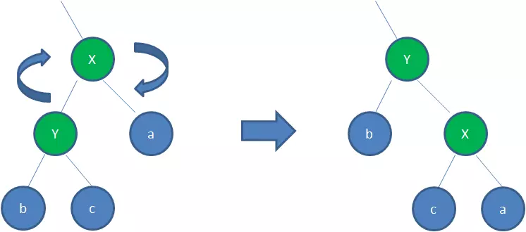

漫画：什么是红黑树？
https://juejin.im/post/5a27c6946fb9a04509096248

红黑树（附动画）
https://www.2cto.com/kf/201605/512263.html

Java8 HashMap 用的红黑树
```java
  private static final boolean RED   = true;
  private static final boolean BLACK = false;
  private class Node
  {
    Key key;
    Value val;
    Node left, right;
    boolean color;   
  // color of parent link
  }
  private boolean isRed(Node x)
  {
    if (x == null) return false;
    return x.color == RED;
  }
```

1.节点是红色或黑色。

2.根节点是`黑色`。

3.每个叶子节点都是`黑色`的空节点（NIL节点）。

4 每个红色节点的两个子节点都是黑色。(从每个叶子到根的所有路径上不能有两个连续的红色节点)

5.**从任一节点到其每个叶子的所有路径都包含相同数目的黑色节点。**


`变色` 为了重新符合红黑树的规则，尝试把红色节点变为黑色，或者把黑色节点变为红色。
```java
private void flipColors(Node h)
{
    assert !isRed(h);
    assert isRed(h.left);
    assert isRed(h.right);
    h.color = RED;
    h.left.color = h.right.color = BLACK;
}
```

`旋转`

`左旋转` 逆时针旋转红黑树的两个节点，使得`父节点`被自己的`右孩子`取代，而自己成为自己的左孩子。

<div align="center">  </div>
``` java
public Node rotateLeft(Node x)
{
    assert isRed(x.right);
    Node y = x.right;
    x.right = y.left;   //step 1
    y.left = x;        //step 2
    y.color = x.color;
    x.color = RED;
    return y;     //setp 3
}
```
身为右孩子的Y取代了X的位置，而X变成了自己的左孩子。此为左旋转。x变为红色，y变为色

`右旋转` 顺时针旋转红黑树的两个节点，使得`父节点`被自己的`左孩子`取代，而自己成为自己的右孩子。

<div align="center">  </div>
```java
public Node rotateRight(Node x)
{
    assert isRed(x.left);
    Node y = x.left;
    x.left = y.right;   //step 1
    y.right = x;        //step 2
    y.color = x.color;
    x.color = RED;
    return y;     //setp 3
}
```
身为左孩子的Y取代了X的位置，而X变成了自己的右孩子。此为右旋转。x变为红色，y变为黑色
