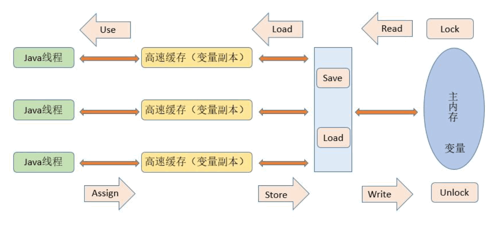

 

图中`高速缓存`即为线程的`工作内存`

`lock` 锁定
`unlock` 解锁

`read` 读取
`load` 载入

`user` 使用
`assign` 赋值

`store` 存储
`write` 写入

### 规则：

1. read 和 load， store和write 顺序顺序执行（不保证连续执行）
2. assign操作之后，必须有store操作
3. 不允许未发生assign操作，进行store操作
4. 一个新的变量智能在主内存中诞生，不允许在工作内存中直接使用一个未被初始化(load和assign)的变量，就是对一个变量实施use、store之前，必须先执行过assign和load操作
5. 一个变量同一时刻只允许一条线程对其进行lock操作
6. 对一个变量执行lock操作，那将会清空工作内存中此变量的值，在执行引擎使用这个变量前，需要重新执行load和assign操作初始化变量的值
7. 没有lock的变量不允许执行unlock操作，也不允许unlock其他线程锁住的变量
8. 执行unlock前，必须要执行store write操作，同步回主内存
