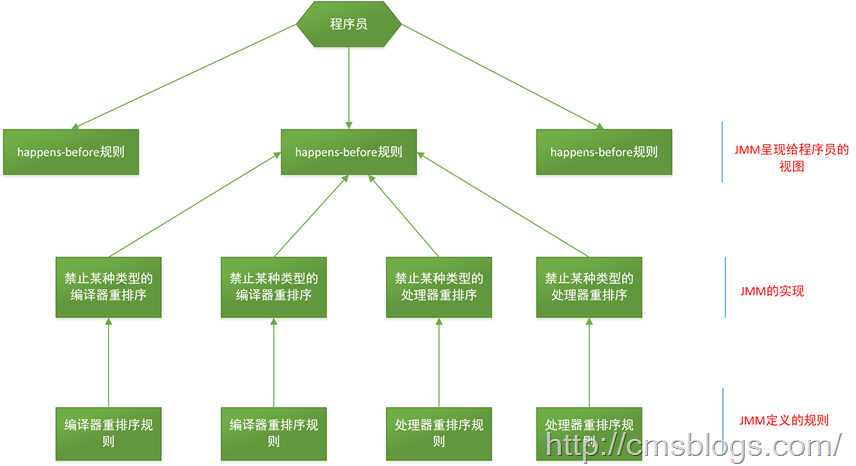

  由于存在线程本地内存和主内存的原因，再加上重排序，会导致多线程环境下存在可见性的问题。
  那么我们正确使用同步、锁的情况下，线程A修改了变量a何时对线程B可见？

  我们无法就所有场景来规定某个线程修改的变量何时对其他线程可见，但是我们可以指定某些规则，这规则就是happens-before，从JDK 5 开始，JMM就使用happens-before的概念来阐述多线程之间的内存可见性。

    **在JMM中，如果一个操作执行的结果需要对另一个操作可见，那么这两个操作之间必须存在happens-before关系。**

  happens-before原则非常重要，**它是判断数据是否存在竞争、线程是否安全的主要依据**，依靠这个原则，我们解决在并发环境下两操作之间是否可能存在冲突的所有问题。下面我们就一个简单的例子稍微了解下happens-before ；
  ```
  i = 1;       //线程A执行
  j = i ;      //线程B执行
  ```
  j 是否等于1呢？假定线程A的操作（i = 1）happens-before线程B的操作（j = i）,那么可以确定线程B执行后j = 1 一定成立，如果他们不存在happens-before原则，那么j = 1 不一定成立。这就是happens-before原则的威力。

  happens-before原则定义如下:
  1. 如果一个操作happens-before另一个操作，那么第一个操作的执行结果将对第二个操作可见，而且第一个操作的执行顺序排在第二个操作之前。
  2. 两个操作之间存在happens-before关系，并不意味着一定要按照happens-before原则制定的顺序来执行。如果`重排序之后的执行结果`与`按照happens-before关系来执行的结果` **一致**，那么这种`重排序并不非法`。

  下面是happens-before原则规则：
  1. 程序次序规则：一个线程内，按照代码顺序，书写在前面的操作先行发生于书写在后面的操作；
  2. 锁定规则：一个unLock操作先行发生于后面对同一个锁额lock操作；
  3. volatile变量规则：对一个变量的 **写操作** 先行发生于后面对这个变量的 **读操作**；
  4. 传递规则：如果操作A先行发生于操作B，而操作B又先行发生于操作C，则可以得出操作A先行发生于操作C；
  5. 线程启动规则：Thread对象的start()方法先行发生于此线程的每个一个动作；
  6. 线程中断规则：对线程interrupt()方法的调用先行发生于被中断线程的代码检测到中断事件的发生；
  7. 线程终结规则：线程中所有的操作都先行发生于线程的终止检测，我们可以通过Thread.join()方法结束、Thread.isAlive()的返回值手段
  检测到线程已经终止执行；
  8. 对象终结规则：一个对象的初始化完成先行发生于他的finalize()方法的开始；
  我们来详细看看上面每条规则（摘自《深入理解Java虚拟机第12章》）：
  **程序次序规则**：一段代码在单线程中执行的结果是有序的。注意是执行结果，因为虚拟机、处理器会对指令进行重排序（重排序后面会详细介绍）。虽然重排序了，但是并不会影响程序的执行结果，所以程序最终执行的结果与顺序执行的结果是一致的。故而这个规则只对单线程有效，在多线程环境下无法保证正确性。

  **锁定规则**：这个规则比较好理解，无论是在单线程环境还是多线程环境，一个锁处于被锁定状态，那么必须先执行unlock操作后面才能进行lock操作。

  **volatile变量规则**：这是一条比较重要的规则，它标志着volatile保证了线程可见性。通俗点讲就是如果一个线程先去写一个volatile变量，然后一个线程去读这个变量，那么这个写操作一定是happens-before读操作的。

  **传递规则**：提现了happens-before原则具有传递性，即A happens-before B , B happens-before C，那么A happens-before C

  **线程启动规则**：假定线程A在执行过程中，通过执行ThreadB.start()来启动线程B，那么线程A对共享变量的修改在接下来线程B开始执行后确保对线程B可见。

  **线程终结规则**：假定线程A在执行的过程中，通过制定ThreadB.join()等待线程B终止，那么线程B在终止之前对共享变量的修改在线程A等待返回后可见。

  上面八条是原生Java满足Happens-before关系的规则，但是我们可以对他们进行推导出其他满足happens-before的规则：

  1. 将一个元素放入一个线程安全的队列的操作Happens-Before从队列中取出这个元素的操作
  2. 将一个元素放入一个线程安全容器的操作Happens-Before从容器中取出这个元素的操作
  3. 在CountDownLatch上的倒数操作Happens-Before CountDownLatch#await()操作
  4. 释放Semaphore许可的操作Happens-Before获得许可操作
  5. Future表示的任务的所有操作Happens-Before Future#get()操作
  6. 向Executor提交一个Runnable或Callable的操作Happens-Before任务开始执行操作

  这里再说一遍happens-before的概念：
    **如果两个操作不存在上述（前面8条 + 后面6条）任一一个happens-before规则，那么这两个操作就没有顺序的保障，JVM可以对这两个操作进行重排序。如果操作A happens-before操作B，那么操作A在内存上所做的操作对操作B都是可见的。**

  下面就用一个简单的例子来描述下happens-before原则：
  ```JAVA
  private int i = 0;
  public void write(int j ){
      i = j;
  }
  public int read(){
      return i;
  }
  ```

  我们约定线程A执行write()，线程B执行read()，且线程A优先于线程B执行，那么线程B获得结果是什么？；我们就这段简单的代码一次分析happens-before的规则（规则5、6、7、8 + 推导的6条可以忽略，因为他们和这段代码毫无关系）：

  1. 由于两个方法是由不同的线程调用，所以肯定不满足程序次序规则；
  2. 两个方法都没有使用锁，所以不满足锁定规则；
  3. 变量i不是用volatile修饰的，所以volatile变量规则不满足；
  4. 传递规则肯定不满足；

  所以我们无法通过happens-before原则推导出线程A happens-before线程B，虽然可以确认在时间上线程A优先于线程B指定，但是就是无法确认线程B获得的结果是什么，所以这段代码不是线程安全的。那么怎么修复这段代码呢？满足规则2、3任一即可。

    **happen-before原则是JMM中非常重要的原则，它是判断数据是否存在竞争、线程是否安全的主要依据，保证了多线程环境下的可见性。**

  下图是happens-before与JMM的关系图（摘自《Java并发编程的艺术》）
  

### 参考资料
  周志明：《深入理解Java虚拟机》
  方腾飞：《Java并发编程的艺术》
