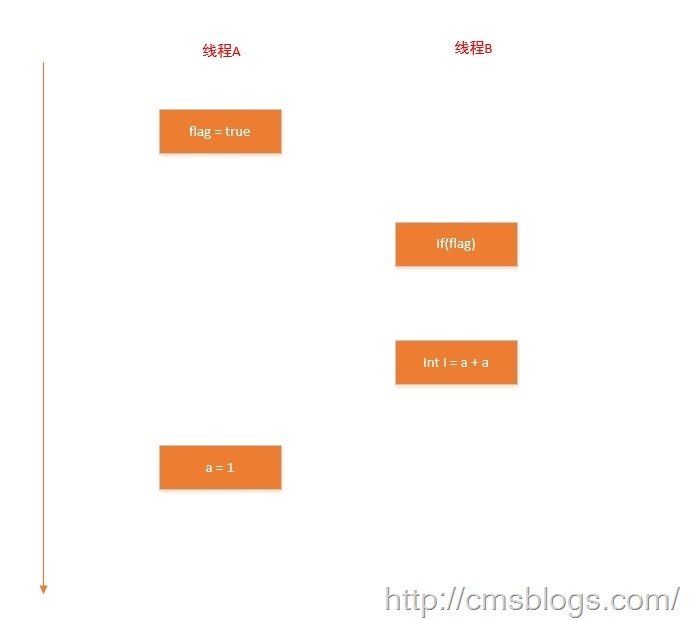

在执行程序时，为了提供性能，处理器和编译器常常会对指令进行重排序，但是不能随意重排序，不是你想怎么排序就怎么排序，它需要满足以下两个条件：

  1. 在单线程环境下不能改变程序运行的结果；
  2. 存在数据依赖关系的不允许重排序

如果看过LZ上篇博客的就会知道，其实这两点可以归结于一点：无法通过happens-before原则推导出来的，JMM允许任意的排序。

### as-if-serial语义

  as-if-serial语义的意思是，所有的操作均可以为了优化而被重排序，但是你必须要保证重排序后执行的结果不能被改变，编译器、runtime、处理器都必须遵守as-if-serial语义。注意as-if-serial只保证单线程环境，多线程环境下无效。

  下面我们用一个简单的示例来说明：
  ```java
  int a = 1 ;      //A
  int b = 2 ;      //B
  int c = a + b;   //C
  ```
  A、B、C三个操作存在如下关系：A、B不存在数据依赖关系，A和C、B和C存在数据依赖关系，因此在进行重排序的时候，A、B可以随意排序，但是必须位于C的前面，执行顺序可以是A –> B –> C或者B –> A –> C。但是无论是何种执行顺序最终的结果C总是等于3。

  as-if-serail语义把单线程程序保护起来了，它可以保证在重排序的前提下程序的最终结果始终都是一致的。

  其实对于上段代码，他们存在这样的happen-before关系：

  A happens-before B
  B happens-before C
  A happens-before C

  1、2是程序顺序次序规则，3是传递性。但是，不是说通过重排序，B可能会排在A之前执行么，为何还会存在存在A happens-beforeB呢？这里再次申明A happens-before B不是A一定会在B之前执行，而是A的对B可见，但是相对于这个程序A的执行结果不需要对B可见，且他们重排序后不会影响结果，所以JMM不会认为这种重排序非法。

  我们需要明白这点：在不改变程序执行结果的前提下，尽可能提高程序的运行效率。

  下面我们在看一段有意思的代码：
  ```java
  public class RecordExample1 {
      public static void main(String[] args){
          int a = 1;
          int b = 2;
          try {
              a = 3;           //A
              b = 1 / 0;       //B
          } catch (Exception e) {
          } finally {
              System.out.println("a = " + a);
          }
      }
  }
  ```
  按照重排序的规则，操作A与操作B有可能会进行重排序，如果重排序了，B会抛出异常（ / by zero），此时A语句一定会执行不到，那么a还会等于3么？
  如果按照as-if-serial原则它就改变了程序的结果。其实JVM对异常做了一种特殊的处理，为了保证as-if-serial语义，Java异常处理机制对重排序做了一种特殊的处理：JIT在重排序时会在catch语句中插入错误代偿代码（a = 3）,这样做虽然会导致cathc里面的逻辑变得复杂，但是JIT优化原则是：尽可能地优化程序正常运行下的逻辑，哪怕以catch块逻辑变得复杂为代价。

### 重排序对多线程的影响
  在单线程环境下由于as-if-serial语义，重排序无法影响最终的结果，但是对于多线程环境呢？
  如下代码（volatile的经典用法）：
  ```java
  public class RecordExample2 {
      int a = 0;
      boolean flag = false;
      /**
       * A线程执行
       */
      public void writer(){
          a = 1;                  // 1
          flag = true;            // 2
      }
      /**
       * B线程执行
       */
      public void read(){
          if(flag){                  // 3
             int i = a + a;          // 4
          }
      }

  }
  ```
  A线程执行writer()，线程B执行read()，线程B在执行时能否读到 a = 1 呢？答案是不一定（**注：X86CPU不支持写写重排序，如果是在x86上面操作，这个一定会是a=1,LZ搞了好久都没有测试出来，最后查资料才发现**）。

  由于操作1 和操作2 之间没有数据依赖性，所以可以进行重排序处理，操作3 和操作4 之间也没有数据依赖性，他们亦可以进行重排序，但是操作3 和操作4 之间存在控制依赖性。假如操作1 和操作2 之间重排序：

  

  按照这种执行顺序线程B肯定读不到线程A设置的a值，在这里多线程的语义就已经被重排序破坏了。

  操作3 和操作4 之间也可以重排序，这里就不阐述了。但是他们之间存在一个控制依赖的关系，因为只有操作3 成立操作4 才会执行。当代码中存在控制依赖性时，会影响指令序列的执行的并行度，所以编译器和处理器会采用猜测执行来克服控制依赖对并行度的影响。假如操作3 和操作4重排序了，操作4 先执行，则先会把计算结果临时保存到重排序缓冲中，当操作3 为真时才会将计算结果写入变量i中

  通过上面的分析，**重排序不会影响单线程环境的执行结果，但是会破坏多线程的执行语义。**

### 参考资料
周志明 ：《深入理解Java虚拟机》
方腾飞：《Java并发编程的艺术》
