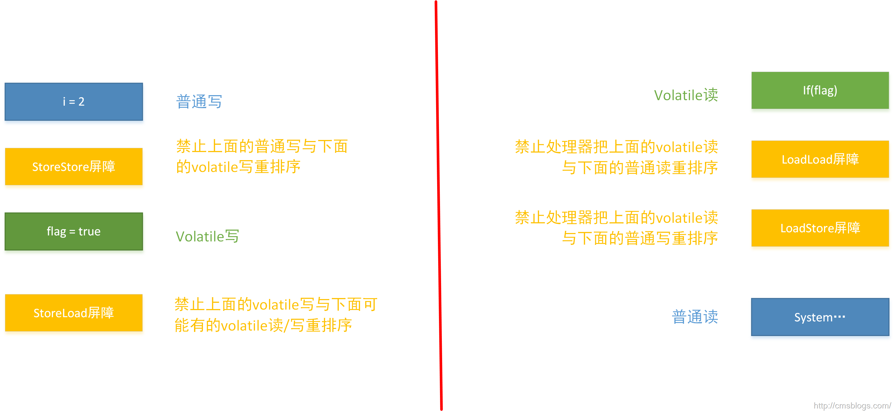

  volatile的特性：

  1. volatile可见性；对一个volatile的读，总可以看到对这个变量最终的写；
  2. volatile原子性；volatile对单个读/写具有原子性（32位Long、Double），但是复合操作除外，例如i++;
  3. JVM底层采用 **内存屏障** 来实现volatile语义

  下面LZ就通过happens-before原则和volatile的内存语义两个方向介绍volatile。

### volatile与happens-before
  happens-before是用来判断是否存数据竞争、线程是否安全的主要依据，它保证了多线程环境下的可见性。
  下面我们就那个经典的例子来分析volatile变量的读写建立的happens-before关系。
  ```java
  public class VolatileTest {
      int i = 0;
      volatile boolean flag = false;
      //Thread A
      public void write(){
          i = 2;              //1
          flag = true;        //2
      }
      //Thread B
      public void read(){
          if(flag){                                   //3
              System.out.println("---i = " + i);      //4
          }
      }
  }
  ```
  依据happens-before原则，就上面程序得到如下关系：

  依据happens-before程序顺序原则：1 happens-before 2、3 happens-before 4；
  根据happens-before的volatile原则：2 happens-before 3；
  根据happens-before的传递性：1 happens-before 4
  操作1、操作4存在happens-before关系，那么1一定是对4可见的。
  可能有同学就会问，操作1、操作2可能会发生重排序啊，会吗？如果看过LZ的博客就会明白，volatile除了保证可见性外，还有就是禁止重排序。
  所以A线程在写volatile变量之前所有可见的共享变量，在线程B读同一个volatile变量后，将立即变得对线程B可见。

### volataile的内存语义及其实现

  在JMM中，线程之间的通信采用共享内存来实现的。volatile的内存语义是：

    **当写一个volatile变量时，JMM会把该线程对应的本地内存中的共享变量值立即刷新到主内存中。**
    **当读一个volatile变量时，JMM会把该线程对应的本地内存设置为无效，直接从主内存中读取共享变量**

  所以volatile的写内存语义是直接刷新到主内存中，读的内存语义是直接从主内存中读取。
  那么volatile的内存语义是如何实现的呢？对于一般的变量则会被重排序，而对于volatile则不能，这样会影响其内存语义，所以为了实现volatile的内存语义JMM会限制重排序。其重排序规则如下：

  翻译如下：

  1. 如果第一个操作为volatile读，则不管第二个操作是啥，都不能重排序。这个操作确保volatile读之后的操作不会被编译器重排序到volatile读之前；
  2. 当第二个操作为volatile写是，则不管第一个操作是啥，都不能重排序。这个操作确保volatile写之前的操作不会被编译器重排序到volatile写之后；
  3. 当第一个操作volatile写，第二操作为volatile读时，不能重排序。

  volatile的底层实现是通过插入内存屏障，但是对于编译器来说，发现一个最优布置来最小化插入内存屏障的总数几乎是不可能的，所以，JMM采用了保守策略。如下：

  * 在每一个volatile写操作前面插入一个StoreStore屏障
  * 在每一个volatile写操作后面插入一个StoreLoad屏障
  * 在每一个volatile读操作后面插入一个LoadLoad屏障
  * 在每一个volatile读操作后面插入一个LoadStore屏障

  StoreStore屏障可以保证在volatile写之前，其前面的所有普通写操作都已经刷新到主内存中。

  StoreLoad屏障的作用是避免volatile写与后面可能有的volatile读/写操作重排序。

  LoadLoad屏障用来禁止处理器把上面的volatile读与下面的普通读重排序。

  LoadStore屏障用来禁止处理器把上面的volatile读与下面的普通写重排序。

  下面我们就上面那个VolatileTest例子分析下：
  ```java
  public class VolatileTest {
      int i = 0;
      volatile boolean flag = false;
      public void write(){
          i = 2;
          flag = true;
      }

      public void read(){
          if(flag){
              System.out.println("---i = " + i);
          }
      }
  }
  ```
  
  上面通过一个例子稍微演示了volatile指令的内存屏障图例。

  volatile的内存屏障插入策略非常保守，其实在实际中，只要不改变volatile写-读得内存语义，编译器可以根据具体情况优化，省略不必要的屏障。如下（摘自方腾飞 《Java并发编程的艺术》）：
  ```java
  public class VolatileBarrierExample {
      int a = 0;
      volatile int v1 = 1;
      volatile int v2 = 2;

      void readAndWrite(){
          int i = v1;     //volatile读
          int j = v2;     //volatile读
          a = i + j;      //普通读
          v1 = i + 1;     //volatile写
          v2 = j * 2;     //volatile写
      }
  }
  ```
  没有优化的示例图如下：
  
  我们来分析上图有哪些内存屏障指令是多余的

  1：这个肯定要保留了

  2：禁止下面所有的普通写与上面的volatile读重排序，但是由于存在第二个volatile读，那个普通的读根本无法越过第二个volatile读。所以可以省略。

  3：下面已经不存在普通读了，可以省略。

  4：保留

  5：保留

  6：下面跟着一个volatile写，所以可以省略

  7：保留

  8：保留

  所以2、3、6可以省略，其示意图如下：
  

### 参考资料
方腾飞：《Java并发编程的艺术》
