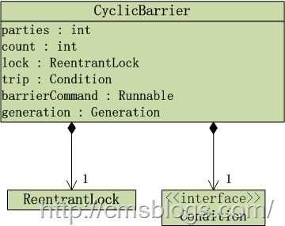

  CyclicBarrier，一个同步辅助类，在API中是这么介绍的：

  **它允许一组线程互相等待，直到到达某个公共屏障点 (common barrier point)。在涉及一组固定大小的线程的程序中，这些线程必须不时地互相等待，此时 CyclicBarrier 很有用。因为该 barrier 在释放等待线程后可以重用，所以称它为循环 的 barrier。**

  通俗点讲就是：让一组线程到达一个屏障时被阻塞，直到最后一个线程到达屏障时，屏障才会开门，所有被屏障拦截的线程才会继续干活。

  实现分析
  CyclicBarrier的结构如下：
  

  通过上图我们可以看到 **CyclicBarrier的底层是使用重入锁ReentrantLock和Condition。** 它有两个构造函数：

  * CyclicBarrier(int parties)：创建一个新的 CyclicBarrier，它将在给定数量的参与者（线程）处于等待状态时启动，但它不会在启动 barrier 时执行预定义的操作。

  * CyclicBarrier(int parties, Runnable barrierAction) ：创建一个新的 CyclicBarrier，它将在给定数量的参与者（线程）处于等待状态时启动，并在启动 barrier 时执行给定的屏障操作，该操作由最后一个进入 barrier 的线程执行。

  parties表示拦截线程的数量。

  barrierAction 为CyclicBarrier接收的Runnable命令，用于在线程到达屏障时，优先执行barrierAction ，用于处理更加复杂的业务场景。
  ```java
  public CyclicBarrier(int parties, Runnable barrierAction) {
      if (parties <= 0) throw new IllegalArgumentException();
      this.parties = parties;
      this.count = parties;
      this.barrierCommand = barrierAction;
  }

  public CyclicBarrier(int parties) {
      this(parties, null);
  }
  ```
  在CyclicBarrier中最重要的方法莫过于await()方法，在所有参与者都已经在此 barrier 上调用 await 方法之前，将一直等待。如下：
  ```java
  public int await() throws InterruptedException, BrokenBarrierException {
      try {
          return dowait(false, 0L);//不超时等待
      } catch (TimeoutException toe) {
          throw new Error(toe); // cannot happen
      }
  }
  ```
  await()方法内部调用dowait(boolean timed, long nanos)方法：
  ```java
  private int dowait(boolean timed, long nanos)
          throws InterruptedException, BrokenBarrierException,
          TimeoutException {
      //获取锁
      final ReentrantLock lock = this.lock;
      lock.lock();
      try {
          //分代
          final Generation g = generation;

          //当前generation“已损坏”，抛出BrokenBarrierException异常
          //抛出该异常一般都是某个线程在等待某个处于“断开”状态的CyclicBarrie
          if (g.broken)
              //当某个线程试图等待处于断开状态的 barrier 时，或者 barrier 进入断开状态而线程处于等待状态时，抛出该异常
              throw new BrokenBarrierException();

          //如果线程中断，终止CyclicBarrier
          if (Thread.interrupted()) {
              breakBarrier();
              throw new InterruptedException();
          }

          //进来一个线程 count - 1
          int index = --count;
          //count == 0 表示所有线程均已到位，触发Runnable任务
          if (index == 0) {  // tripped
              boolean ranAction = false;
              try {
                  final Runnable command = barrierCommand;
                  //触发任务
                  if (command != null)
                      command.run();
                  ranAction = true;
                  //唤醒所有等待线程，并更新generation
                  nextGeneration();
                  return 0;
              } finally {
                  if (!ranAction)
                      breakBarrier();
              }
          }


          for (;;) {
              try {
                  //如果不是超时等待，则调用Condition.await()方法等待
                  if (!timed)
                      trip.await();
                  else if (nanos > 0L)
                      //超时等待，调用Condition.awaitNanos()方法等待
                      nanos = trip.awaitNanos(nanos);
              } catch (InterruptedException ie) {
                  if (g == generation && ! g.broken) {
                      breakBarrier();
                      throw ie;
                  } else {
                      // We're about to finish waiting even if we had not
                      // been interrupted, so this interrupt is deemed to
                      // "belong" to subsequent execution.
                      Thread.currentThread().interrupt();
                  }
              }

              if (g.broken)
                  throw new BrokenBarrierException();

              //generation已经更新，返回index
              if (g != generation)
                  return index;

              //“超时等待”，并且时间已到,终止CyclicBarrier，并抛出异常
              if (timed && nanos <= 0L) {
                  breakBarrier();
                  throw new TimeoutException();
              }
          }
      } finally {
          //释放锁
          lock.unlock();
      }
  }
  ```
  其实await()的处理逻辑还是比较简单的：如果该线程不是到达的最后一个线程，则他会一直处于等待状态，除非发生以下情况：

  1. 最后一个线程到达，即index == 0
  2. 超出了指定时间（超时等待）
  3. 其他的某个线程中断当前线程
  4. 其他的某个线程中断另一个等待的线程
  5. 其他的某个线程在等待barrier超时
  6. 其他的某个线程在此barrier调用reset()方法。reset()方法用于将屏障重置为初始状态。


  在上面的源代码中，我们可能需要注意Generation 对象，在上述代码中我们总是可以看到抛出BrokenBarrierException异常，那么什么时候抛出异常呢？如果一个线程处于等待状态时，如果其他线程调用reset()，或者调用的barrier原本就是被损坏的，则抛出BrokenBarrierException异常。同时，任何线程在等待时被中断了，则其他所有线程都将抛出BrokenBarrierException异常，并将barrier置于损坏状态。

  同时，Generation描述着CyclicBarrier的更显换代。在CyclicBarrier中，同一批线程属于同一代。当有parties个线程到达barrier，generation就会被更新换代。其中broken标识该当前CyclicBarrier是否已经处于中断状态。
  ```java
  private static class Generation {
        boolean broken = false;
  }
  ```
  默认barrier是没有损坏的。

  当barrier损坏了或者有一个线程中断了，则通过breakBarrier()来终止所有的线程：
  ```java
  private void breakBarrier() {
       generation.broken = true;
       count = parties;
       trip.signalAll();
  }
  ```
  在breakBarrier()中除了将broken设置为true，还会调用signalAll将在CyclicBarrier处于等待状态的线程全部唤醒。

  当所有线程都已经到达barrier处（index == 0），则会通过nextGeneration()进行更新换地操作，在这个步骤中，做了三件事：唤醒所有线程，重置count，generation。
  ```java
  private void nextGeneration() {
      trip.signalAll();
      count = parties;
      generation = new Generation();
  }
  ```
  CyclicBarrier同时也提供了await(long timeout, TimeUnit unit) 方法来做超时控制，内部还是通过调用doawait()实现的。
### 总结

  CyclicBarrier parties参数，await()等到parties个线程都执行后再获取到锁。

### 应用场景

  **CyclicBarrier试用于多线程结果合并的操作，用于多线程计算数据，最后合并计算结果的应用场景。** 比如我们需要统计多个Excel中的数据，然后等到一个总结果。我们可以通过多线程处理每一个Excel，执行完成后得到相应的结果，最后通过barrierAction来计算这些线程的计算结果，得到所有Excel的总和。

  应用示例
  比如我们开会只有等所有的人到齐了才会开会，如下：
  ```java
  public class CyclicBarrierTest {

      private static CyclicBarrier cyclicBarrier;

      static class CyclicBarrierThread extends Thread{
          public void run() {
              System.out.println(Thread.currentThread().getName() + "到了");
              //等待
              try {
                  cyclicBarrier.await();
              } catch (Exception e) {
                  e.printStackTrace();
              }
          }
      }

      public static void main(String[] args){

          cyclicBarrier = new CyclicBarrier(5, new Runnable() {
              @Override
              public void run() {
                  System.out.println("人到齐了，开会吧....");
              }
          });

          for(int i = 0 ; i < 5 ; i++){
              new CyclicBarrierThread().start();
          }
      }
  }
  ```
运行结果：

