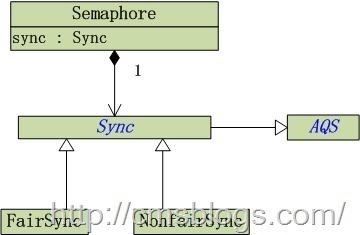

  信号量Semaphore是一个控制访问多个共享资源的计数器，和CountDownLatch一样，其本质上是一个“共享锁”。

  Semaphore，在API是这么介绍的：

  一个计数信号量。从概念上讲，信号量维护了一个许可集。如有必要，在许可可用前会阻塞每一个 acquire()，然后再获取该许可。每个 release() 添加一个许可，从而可能释放一个正在阻塞的获取者。但是，不使用实际的许可对象，Semaphore 只对可用许可的号码进行计数，并采取相应的行动。

  Semaphore 通常用于限制可以访问某些资源（物理或逻辑的）的线程数目。

  下面我们就一个停车场的简单例子来阐述Semaphore：

  为了简单起见我们假设停车场仅有5个停车位，一开始停车场没有车辆所有车位全部空着，然后先后到来三辆车，停车场车位够，安排进去停车，然后又来三辆，这个时候由于只有两个停车位，所有只能停两辆，其余一辆必须在外面候着，直到停车场有空车位，当然以后每来一辆都需要在外面候着。当停车场有车开出去，里面有空位了，则安排一辆车进去（至于是哪辆 要看选择的机制是公平还是非公平）。

  从程序角度看，停车场就相当于信号量Semaphore，其中许可数为5，车辆就相对线程。当来一辆车时，许可数就会减 1 ，当停车场没有车位了（许可书 == 0 ），其他来的车辆需要在外面等候着。如果有一辆车开出停车场，许可数 + 1，然后放进来一辆车。

  号量Semaphore是一个非负整数（>=1）。当一个线程想要访问某个共享资源时，它必须要先获取Semaphore，当Semaphore >0时，获取该资源并使Semaphore – 1。如果Semaphore值 = 0，则表示全部的共享资源已经被其他线程全部占用，线程必须要等待其他线程释放资源。当线程释放资源时，Semaphore则+1

  实现分析
  Semaphore结构如下：
  
  从上图可以看出Semaphore内部包含公平锁（FairSync）和非公平锁（NonfairSync），继承内部类Sync，其中Sync继承AQS（再一次阐述AQS的重要性）。

  Semaphore提供了两个构造函数：

  1. Semaphore(int permits) ：创建具有给定的许可数和非公平的公平设置的 Semaphore。
  2. Semaphore(int permits, boolean fair) ：创建具有给定的许可数和给定的公平设置的 Semaphore。
  实现如下：
  ```JAVA
  public Semaphore(int permits) {
      sync = new NonfairSync(permits);
  }

  public Semaphore(int permits, boolean fair) {
      sync = fair ? new FairSync(permits) : new NonfairSync(permits);
  }
  ```
  Semaphore默认选择非公平锁。

  当信号量Semaphore = 1 时，它可以当作互斥锁使用。其中0、1就相当于它的状态，当=1时表示其他线程可以获取，当=0时，排他，即其他线程必须要等待。

  信号量获取
  Semaphore提供了acquire()方法来获取一个许可。
  ```JAVA
  public void acquire() throws InterruptedException {
      sync.acquireSharedInterruptibly(1);
  }
  ```
  内部调用AQS的acquireSharedInterruptibly(int arg)，该方法以共享模式获取同步状态：
  ```JAVA
  public final void acquireSharedInterruptibly(int arg)
          throws InterruptedException {
      if (Thread.interrupted())
          throw new InterruptedException();
      if (tryAcquireShared(arg) < 0)
          doAcquireSharedInterruptibly(arg);
  }
  ```
  在acquireSharedInterruptibly(int arg)中，tryAcquireShared(int arg)由子类来实现，对于Semaphore而言，如果我们选择非公平模式，则调用NonfairSync的tryAcquireShared(int arg)方法，否则调用FairSync的tryAcquireShared(int arg)方法。

### 公平
  ```JAVA
  protected int tryAcquireShared(int acquires) {
      for (;;) {
          //判断该线程是否位于CLH队列的列头
          if (hasQueuedPredecessors())
              return -1;
          //获取当前的信号量许可
          int available = getState();

          //设置“获得acquires个信号量许可之后，剩余的信号量许可数”
          int remaining = available - acquires;

          //CAS设置信号量
          if (remaining < 0 ||
                  compareAndSetState(available, remaining))
              return remaining;
      }
  }
  ```

### 非公平

  对于非公平而言，因为它不需要判断当前线程是否位于CLH同步队列列头，所以相对而言会简单些。
  ```JAVA
  protected int tryAcquireShared(int acquires) {
      return nonfairTryAcquireShared(acquires);
  }

  final int nonfairTryAcquireShared(int acquires) {
      for (;;) {
          int available = getState();
          int remaining = available - acquires;
          if (remaining < 0 ||
              compareAndSetState(available, remaining))
              return remaining;
      }
  }
  ```

###信号量释放
  获取了许可，当用完之后就需要释放，Semaphore提供release()来释放许可。
  ```JAVA
  public void release() {
      sync.releaseShared(1);
  }
  ```
  内部调用AQS的releaseShared(int arg)：
  ```JAVA
  public final boolean releaseShared(int arg) {
      if (tryReleaseShared(arg)) {
          doReleaseShared();
          return true;
      }
      return false;
  }
  ```
  releaseShared(int arg)调用Semaphore内部类Sync的tryReleaseShared(int arg)：
  ```JAVA
  protected final boolean tryReleaseShared(int releases) {
      for (;;) {
          int current = getState();
          //信号量的许可数 = 当前信号许可数 + 待释放的信号许可数
          int next = current + releases;
          if (next < current) // overflow
              throw new Error("Maximum permit count exceeded");
          //设置可获取的信号许可数为next
          if (compareAndSetState(current, next))
              return true;
      }
  }
  ```

### 总结
  semaphore permits参数 信号量 ， acquire()获取 ，release()释放

### 应用示例
我们已停车为示例：
  ```java
  public class SemaphoreTest {
      static class Parking{
          //信号量
          private Semaphore semaphore;
          Parking(int count){
              semaphore = new Semaphore(count);
          }
          public void park(){
              try {
                  //获取信号量
                  semaphore.acquire();
                  long time = (long) (Math.random() * 10);
                  System.out.println(Thread.currentThread().getName() + "进入停车场，停车" + time + "秒..." );
                  Thread.sleep(time);
                  System.out.println(Thread.currentThread().getName() + "开出停车场...");
              } catch (InterruptedException e) {
                  e.printStackTrace();
              } finally {
                  semaphore.release();
              }
          }
      }
      static class Car extends Thread {
          Parking parking ;
          Car(Parking parking){
              this.parking = parking;
          }
          @Override
          public void run() {
              parking.park();     //进入停车场
          }
      }
      public static void main(String[] args){
          Parking parking = new Parking(3);

          for(int i = 0 ; i < 5 ; i++){
              new Car(parking).start();
          }
      }
  }
  ```
  运行结果如下：
  
