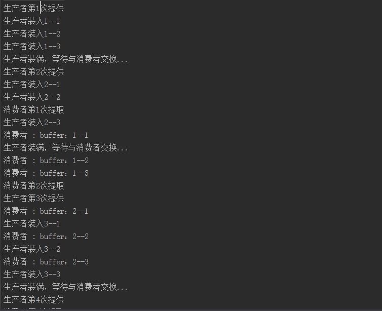

  前面三篇博客分别介绍了CyclicBarrier、CountDownLatch、Semaphore，现在介绍并发工具类中的最后一个Exchange。Exchange是最简单的也是最复杂的，简单在于API非常简单，就一个构造方法和两个exchange()方法，最复杂在于它的实现是最复杂的（反正我是看晕了的）。

  在API是这么介绍的：可以在对中对元素进行配对和交换的线程的同步点。每个线程将条目上的某个方法呈现给 exchange 方法，与伙伴线程进行匹配，并且在返回时接收其伙伴的对象。Exchanger 可能被视为 SynchronousQueue 的双向形式。Exchanger 可能在应用程序（比如遗传算法和管道设计）中很有用。

  Exchanger，它允许在并发任务之间交换数据。具体来说，Exchanger类允许在两个线程之间定义同步点。当两个线程都到达同步点时，他们交换数据结构，因此第一个线程的数据结构进入到第二个线程中，第二个线程的数据结构进入到第一个线程中。

  应用示例
  Exchange实现较为复杂，我们先看其怎么使用，然后再来分析其源码。现在我们用Exchange来模拟生产-消费者问题：
  ```java
  public class ExchangerTest {
      static class Producer implements Runnable{

          //生产者、消费者交换的数据结构
          private List<String> buffer;

          //步生产者和消费者的交换对象
          private Exchanger<List<String>> exchanger;

          Producer(List<String> buffer,Exchanger<List<String>> exchanger){
              this.buffer = buffer;
              this.exchanger = exchanger;
          }

          @Override
          public void run() {
              for(int i = 1 ; i < 5 ; i++){
                  System.out.println("生产者第" + i + "次提供");
                  for(int j = 1 ; j <= 3 ; j++){
                      System.out.println("生产者装入" + i  + "--" + j);
                      buffer.add("buffer：" + i + "--" + j);
                  }

                  System.out.println("生产者装满，等待与消费者交换...");
                  try {
                      exchanger.exchange(buffer);
                  } catch (InterruptedException e) {
                      e.printStackTrace();
                  }
              }
          }
      }

      static class Consumer implements Runnable {
          private List<String> buffer;

          private final Exchanger<List<String>> exchanger;

          public Consumer(List<String> buffer, Exchanger<List<String>> exchanger) {
              this.buffer = buffer;
              this.exchanger = exchanger;
          }

          @Override
          public void run() {
              for (int i = 1; i < 5; i++) {
                  //调用exchange()与消费者进行数据交换
                  try {
                      buffer = exchanger.exchange(buffer);
                  } catch (InterruptedException e) {
                      e.printStackTrace();
                  }

                  System.out.println("消费者第" + i + "次提取");
                  for (int j = 1; j <= 3 ; j++) {
                      System.out.println("消费者 : " + buffer.get(0));
                      buffer.remove(0);
                  }
              }
          }
      }

      public static void main(String[] args){
          List<String> buffer1 = new ArrayList<String>();
          List<String> buffer2 = new ArrayList<String>();

          Exchanger<List<String>> exchanger = new Exchanger<List<String>>();

          Thread producerThread = new Thread(new Producer(buffer1,exchanger));
          Thread consumerThread = new Thread(new Consumer(buffer2,exchanger));

          producerThread.start();
          consumerThread.start();
      }
  }
  ```
  运行结果：
  

  首先生产者Producer、消费者Consumer首先都创建一个缓冲列表，通过Exchanger来同步交换数据。消费中通过调用Exchanger与生产者进行同步来获取数据，而生产者则通过for循环向缓存队列存储数据并使用exchanger对象消费者同步。到消费者从exchanger哪里得到数据后，他的缓冲列表中有3个数据，而生产者得到的则是一个空的列表。上面的例子充分展示了消费者-生产者是如何利用Exchanger来完成数据交换的。

  在Exchanger中，如果一个线程已经到达了exchanger节点时，对于它的伙伴节点的情况有三种：

  如果它的伙伴节点在该线程到达之前已经调用了exchanger方法，则它会唤醒它的伙伴然后进行数据交换，得到各自数据返回。
  如果它的伙伴节点还没有到达交换点，则该线程将会被挂起，等待它的伙伴节点到达被唤醒，完成数据交换。
  如果当前线程被中断了则抛出异常，或者等待超时了，则抛出超时异常。

### 实现分析
