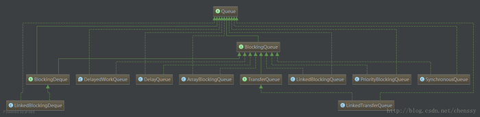

整个类图：

### BlockingQueue

BlockingQueue接口实现Queue接口，它支持两个附加操作：获取元素时等待队列变为非空，以及存储元素时等待空间变得可用。相对于同一操作他提供了四种机制：抛出异常、返回特殊值、阻塞等待、超时：

`BlockingQueue`常用于 **生产者和消费者场景**。

JDK 8 中提供了七个阻塞队列可供使用（上图的`DelayedWorkQueue`是`ScheduledThreadPoolExecutor的内部类`）：

`ArrayBlockingQueue` ：一个由`数组`结构组成的`有界阻塞`队列。
`LinkedBlockingQueue` ：一个由`链表`结构组成的`无界阻塞`队列。
`PriorityBlockingQueue` ：一个支持`优先级`排序的`无界阻塞`队列。
`DelayQueue`：一个使用`优先级`队列实现的`无界阻塞`队列。
`SynchronousQueue`：一个`不存储元素`的`阻塞`队列。
`LinkedTransferQueue`：一个由`链表`结构组成的`无界阻塞`队列。
`LinkedBlockingDeque`：一个由`链表`结构组成的`双向阻塞`队列。

### 1. ArrayBlockingQueue
基于数组的阻塞队列，ArrayBlockingQueue内部维护这一个定长数组，阻塞队列的大小在初始化时就已经确定了，其后无法更改。

采用可重入锁ReentrantLock来保证线程安全性，但是生产者和消费者是共用同一个锁对象，这样势必会导致降低一定的吞吐量。当然ArrayBlockingQueue完全可以采用分离锁来实现生产者和消费者的并行操作，但是我认为这样做只会给代码带来额外的复杂性，对于性能而言应该不会有太大的提升，因为基于数组的ArrayBlockingQueue在数据的写入和读取操作已经非常轻巧了。

ArrayBlockingQueue支持公平性和非公平性，默认采用非公平模式，可以通过构造函数设置为公平访问策略（true）。

### 2. PriorityBlockingQueue
PriorityBlockingQueue是支持优先级的无界队列。默认情况下采用自然顺序排序，当然也可以通过自定义Comparator来指定元素的排序顺序。

PriorityBlockingQueue内部采用二叉堆的实现方式，整个处理过程并不是特别复杂。添加操作则是不断“上冒”，而删除操作则是不断“下掉”。

### 3. DelayQueue
DelayQueue是一个支持延时操作的无界阻塞队列。列头的元素是最先“到期”的元素，如果队列里面没有元素到期，是不能从列头获取元素的，哪怕有元素也不行。也就是说只有在延迟期满时才能够从队列中去元素。

它主要运用于如下场景：

缓存系统的设计：缓存是有一定的时效性的，可以用DelayQueue保存缓存的有效期，然后利用一个线程查询DelayQueue，如果取到元素就证明该缓存已经失效了。
定时任务的调度：DelayQueue保存当天将要执行的任务和执行时间，一旦取到元素（任务），就执行该任务。
DelayQueue采用支持优先级的PriorityQueue来实现，但是队列中的元素必须要实现Delayed接口，Delayed接口用来标记那些应该在给定延迟时间之后执行的对象，该接口提供了getDelay()方法返回元素节点的剩余时间。同时，元素也必须要实现compareTo()方法，compareTo()方法需要提供与getDelay()方法一致的排序。

### 4. SynchronousQueue
SynchronousQueue是一个神奇的队列，他是一个不存储元素的阻塞队列，也就是说他的每一个put操作都需要等待一个take操作，否则就不能继续添加元素了，有点儿像Exchanger，类似于生产者和消费者进行交换。

队列本身不存储任何元素，所以非常适用于传递性场景，两者直接进行对接。其吞吐量会高于ArrayBlockingQueue和LinkedBlockingQueue。

SynchronousQueue支持公平和非公平的访问策略，在默认情况下采用非公平性，也可以通过构造函数来设置为公平性。

SynchronousQueue的实现核心为Transferer接口，该接口有TransferQueue和TransferStack两个实现类，分别对应着公平策略和非公平策略。接口Transferer有一个tranfer()方法，该方法定义了转移数据，如果e != null，相当于将一个数据交给消费者，如果e == null，则相当于从一个生产者接收一个消费者交出的数据。

### 5. LinkedTransferQueue
LinkedTransferQueue是一个由链表组成的的无界阻塞队列，该队列是一个相当牛逼的队列：它是ConcurrentLinkedQueue、SynchronousQueue (公平模式下)、无界的LinkedBlockingQueues等的超集。

与其他BlockingQueue相比，他多实现了一个接口TransferQueue，该接口是对BlockingQueue的一种补充，多了tryTranfer()和transfer()两类方法：

tranfer()：若当前存在一个正在等待获取的消费者线程，即立刻移交之。 否则，会插入当前元素e到队列尾部，并且等待进入阻塞状态，到有消费者线程取走该元素

tryTranfer()： 若当前存在一个正在等待获取的消费者线程（使用take()或者poll()函数），使用该方法会即刻转移/传输对象元素e；若不存在，则返回false，并且不进入队列。这是一个不阻塞的操作

### 6. LinkedBlockingDeque
LinkedBlockingDeque是一个有链表组成的双向阻塞队列，与前面的阻塞队列相比它支持从两端插入和移出元素。以first结尾的表示从对头操作，以last结尾的表示从对尾操作。

在初始化LinkedBlockingDeque时可以初始化队列的容量，用来防止其再扩容时过渡膨胀。另外双向阻塞队列可以运用在“工作窃取”模式中。
