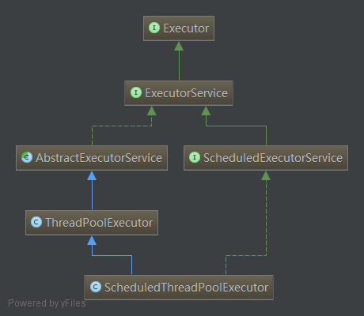
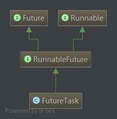

t
  经历了Java内存模型、JUC基础之AQS、CAS、Lock、并发工具类、并发容器、阻塞队列、atomic类后，我们开始JUC的最后一部分：线程池。在这个部分你将了解到下面几个部分：

  1. 线程池的基础架构
  2. 线程池的原理分析
  3. 线程池核心类的源码分析
  4. 线程池调优

  Executor
  我们先看线程池的基础架构图：
  

### Executor

  Executor，任务的执行者，线程池框架中几乎所有类都直接或者间接实现Executor接口，它是线程池框架的基础。Executor提供了一种将“任务提交”与“任务执行”分离开来的机制，它仅提供了一个Execute()方法用来执行已经提交的Runnable任务。
  ```java
  public interface Executor {
      void execute(Runnable command);
  }
  ```
### ExcutorService
  继承Executor，它是“执行者服务”接口，它是为"执行者接口Executor"服务而存在的。准确的地说，ExecutorService提供了"将任务提交给执行者的接口(submit方法)"，"让执行者执行任务(invokeAll, invokeAny方法)"的接口等等。
  ```java
  public interface ExecutorService extends Executor {
      /**
       * 启动一次顺序关闭，执行以前提交的任务，但不接受新任务
       */
      void shutdown();

      /**
       * 试图停止所有正在执行的活动任务，暂停处理正在等待的任务，并返回等待执行的任务列表
       */
      List<Runnable> shutdownNow();

      /**
       * 如果此执行程序已关闭，则返回 true。
       */
      boolean isShutdown();

      /**
       * 如果关闭后所有任务都已完成，则返回 true
       */
      boolean isTerminated();

      /**
       * 请求关闭、发生超时或者当前线程中断，无论哪一个首先发生之后，都将导致阻塞，直到所有任务完成执行
       */
      boolean awaitTermination(long timeout, TimeUnit unit)
          throws InterruptedException;

      /**
       * 提交一个返回值的任务用于执行，返回一个表示任务的未决结果的 Future
       */
      <T> Future<T> submit(Callable<T> task);

      /**
       * 提交一个 Runnable 任务用于执行，并返回一个表示该任务的 Future
       */
      <T> Future<T> submit(Runnable task, T result);

      /**
       * 提交一个 Runnable 任务用于执行，并返回一个表示该任务的 Future
       */
      Future<?> submit(Runnable task);

      /**
       * 执行给定的任务，当所有任务完成时，返回保持任务状态和结果的 Future 列表
       */
      <T> List<Future<T>> invokeAll(Collection<? extends Callable<T>> tasks)
          throws InterruptedException;

      /**
       * 执行给定的任务，当所有任务完成或超时期满时（无论哪个首先发生），返回保持任务状态和结果的 Future 列表
       */
      <T> List<Future<T>> invokeAll(Collection<? extends Callable<T>> tasks,
                                    long timeout, TimeUnit unit)
          throws InterruptedException;

      /**
       * 执行给定的任务，如果某个任务已成功完成（也就是未抛出异常），则返回其结果
       */
      <T> T invokeAny(Collection<? extends Callable<T>> tasks)
          throws InterruptedException, ExecutionException;

      /**
       * 执行给定的任务，如果在给定的超时期满前某个任务已成功完成（也就是未抛出异常），则返回其结果
       */
      <T> T invokeAny(Collection<? extends Callable<T>> tasks,
                      long timeout, TimeUnit unit)
          throws InterruptedException, ExecutionException, TimeoutException;
  }
  ```
### AbstractExecutorService

  抽象类，实现ExecutorService接口，为其提供默认实现。AbstractExecutorService除了实现ExecutorService接口外，还提供了newTaskFor()方法返回一个RunnableFuture，在运行的时候，它将调用底层可调用任务，作为 Future 任务，它将生成可调用的结果作为其结果，并为底层任务提供取消操作。

### ScheduledExecutorService

  继承ExcutorService，为一个“延迟”和“定期执行”的ExecutorService。他提供了一些如下几个方法安排任务在给定的延时执行或者周期性执行。
  ```java
  // 创建并执行在给定延迟后启用的 ScheduledFuture。
  <V> ScheduledFuture<V> schedule(Callable<V> callable, long delay, TimeUnit unit)

  // 创建并执行在给定延迟后启用的一次性操作。
  ScheduledFuture<?> schedule(Runnable command, long delay, TimeUnit unit)

  // 创建并执行一个在给定初始延迟后首次启用的定期操作，后续操作具有给定的周期；
  //也就是将在 initialDelay 后开始执行，然后在 initialDelay+period 后执行，接着在 initialDelay + 2 * period 后执行，依此类推。
  ScheduledFuture<?> scheduleAtFixedRate(Runnable command, long initialDelay, long period, TimeUnit unit)

  // 创建并执行一个在给定初始延迟后首次启用的定期操作，随后，在每一次执行终止和下一次执行开始之间都存在给定的延迟。
  ScheduledFuture<?> scheduleWithFixedDelay(Runnable command, long initialDelay, long delay, TimeUnit unit)
  ```

### ThreadPoolExecutor

  大名鼎鼎的“线程池”，后续做详细介绍。

### ScheduledThreadPoolExecutor

  ScheduledThreadPoolExecutor继承ThreadPoolExecutor并且实现ScheduledExecutorService接口，是两者的集大成者，相当于提供了“延迟”和“周期执行”功能的ThreadPoolExecutor。

### Executors

  静态工厂类，提供了Executor、ExecutorService、ScheduledExecutorService、ThreadFactory 、Callable 等类的静态工厂方法，通过这些工厂方法我们可以得到相对应的对象。

  1. 创建并返回设置有常用配置字符串的 ExecutorService 的方法。
  2. 创建并返回设置有常用配置字符串的 ScheduledExecutorService 的方法。
  3. 创建并返回“包装的”ExecutorService 方法，它通过使特定于实现的方法不可访问来禁用重新配置。
  4. 创建并返回 ThreadFactory 的方法，它可将新创建的线程设置为已知的状态。
  5. 创建并返回非闭包形式的 Callable 的方法，这样可将其用于需要 Callable 的执行方法中。

### Future
  Future接口和实现Future接口的FutureTask代表了线程池的异步计算结果。

  AbstractExecutorService提供了newTaskFor()方法返回一个RunnableFuture，除此之外当我们把一个Runnable或者Callable提交给（submit()）ThreadPoolExecutor或者ScheduledThreadPoolExecutor时，他们则会向我们返回一个FutureTask对象。如下：
  ```java
  protected <T> RunnableFuture<T> newTaskFor(Runnable runnable, T value) {
      return new FutureTask<T>(runnable, value);
  }

      protected <T> RunnableFuture<T> newTaskFor(Callable<T> callable) {
      return new FutureTask<T>(callable);
  }

  <T> Future<T> submit(Callable<T> task)
  <T> Future<T> submit(Runnable task, T result)
  Future<> submit(Runnable task)
  ```
  
  Future

  作为异步计算的顶层接口，Future对具体的Runnable或者Callable任务提供了三种操作：执行任务的取消、查询任务是否完成、获取任务的执行结果。其接口定义如下：
  ```java
  public interface Future<V> {

      /**
       * 试图取消对此任务的执行
       * 如果任务已完成、或已取消，或者由于某些其他原因而无法取消，则此尝试将失败。
       * 当调用 cancel 时，如果调用成功，而此任务尚未启动，则此任务将永不运行。
       * 如果任务已经启动，则 mayInterruptIfRunning 参数确定是否应该以试图停止任务的方式来中断执行此任务的线程
       */
      boolean cancel(boolean mayInterruptIfRunning);

      /**
       * 如果在任务正常完成前将其取消，则返回 true
       */
      boolean isCancelled();

      /**
       * 如果任务已完成，则返回 true
       */
      boolean isDone();

      /**
       *   如有必要，等待计算完成，然后获取其结果
       */
      V get() throws InterruptedException, ExecutionException;

      /**
       * 如有必要，最多等待为使计算完成所给定的时间之后，获取其结果（如果结果可用）
       */
      V get(long timeout, TimeUnit unit)
          throws InterruptedException, ExecutionException, TimeoutException;
  }
  ```
  RunnableFuture

  继承Future、Runnable两个接口，为两者的合体，即所谓的Runnable的Future。提供了一个run()方法可以完成Future并允许访问其结果。
  ```java
  public interface RunnableFuture<V> extends Runnable, Future<V> {
      //在未被取消的情况下，将此 Future 设置为计算的结果
      void run();
  }
  ```
  FutureTask

  实现RunnableFuture接口，既可以作为Runnable被执行，也可以作为Future得到Callable的返回值。
