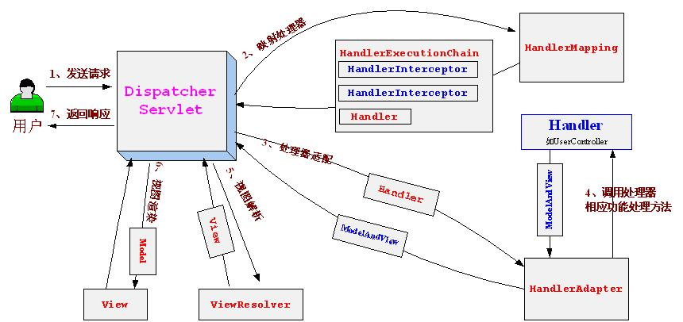

https://www.cnblogs.com/hantalk/p/6652967.html

一、WEB容器在启动时，它会为每个WEB应用程序都创建一个对应的ServletContext对象（每个web应用程序唯一），它代表当前web应用web容器提供其一个全局的上下文环境，其为后面的spring IoC容器提供宿主环境；

二、读取web.xml

服务器软件或容器如（tomcat）加载项目中的web.xml文件，通过其中的各种配置来启动项目，只有其中配置的各项均无误时，项目才能正确启动。web.xml有多项标签，在其加载的过程中顺序依次为：**context-param >> listener >> fileter >> servlet​**。（同类多个节点以出现顺序依次加载）

1、ServletContext创建后，通过启动WebApplicationContext的Servlet（org.springframework.web.context.ContextLoaderServlet）或Web容器监听器（org.springframework.web.context.ContextLoaderListener）触发初始化WebApplicationContext事件，这个就是spring的ioc容器；(application context的初始化过程，可参考：http://www.cnblogs.com/hantalk/p/6647772.html）
  ```xml
  <listener>
    <description>Spring配置(此配置在所有监听器之前加载)</description>
    <listener-class>org.springframework.web.context.ContextLoaderListener</listener-class>
  </listener>
  ```
  ```xml
  <servlet>
    <servlet-name>context</servlet-name>
    <servlet-class>org.springframework.web.context.ContextLoaderServlet</servlet-class>
    <load-on-startup>1</load-on-startup>
  </servlet>
  ```

2、容器会读取context-param(springmvc中可以没有这个context-param，即WebApplicationContext不用配置具体数据)，spring以WebApplicationContext.ROOTWEBAPPLICATIONCONTEXTATTRIBUTE为属性Key，context-param为属性value对并存入servletContext；
``` java
servletContext.setAttribute(WebApplicationContext.ROOT_WEB_APPLICATION_CONTEXT_ATTRIBUTE,this.context);
```
例如:
```xml
<context-param>
      <param-name>contextConfigLocation</param-name>
      <param-value>
          classpath:spring-common-config.xml,
          classpath:spring-budget-config.xml
      </param-value>
</context-param>
```
3、读取listener创建监听，根据指定的类路径来实例化过滤器filter；

4、初始化web.xml中的dispatcherservlet

首先，利用WebApplicationContext.ROOTWEBAPPLICATIONCONTEXTATTRIBUTE从ServletContext中获取之前的WebApplicationContext作为自己上下文的parent上下文。

然后，读取/WEB-INF/[servlet名字]-servlet.xml文件，初始化自己持有的上下文。初始化完毕后，spring也将dispatcherservlet的上下文存到ServletContext中。

DispatcherServlet主要用作职责调度工作，本身主要用于控制流程，读下面代码，可以在initStrategies方法中看到主要职责如下：

1、文件上传解析，如果请求类型是multipart将通过MultipartResolver进行文件上传解析；

2、通过HandlerMapping，将请求映射到处理器（返回一个HandlerExecutionChain，它包括一个处理器、多个HandlerInterceptor拦截器）；

3、通过HandlerAdapter支持多种类型的处理器(HandlerExecutionChain中的处理器)；

4、通过ViewResolver解析逻辑视图名到具体视图实现；

5、本地化解析；

6、渲染具体的视图等；

7、如果执行过程中遇到异常将交给HandlerExceptionResolver来解析。

``` java
public class DispatcherServlet extends FrameworkServlet {
     //实现子类的onRefresh()方法，该方法委托为initStrategies()方法。
    @Override
    protected void onRefresh(ApplicationContext context) {
       initStrategies(context);
    }

    //初始化默认的Spring Web MVC框架使用的策略（如HandlerMapping）
    protected void initStrategies(ApplicationContext context) {
       initMultipartResolver(context);
       initLocaleResolver(context);
       initThemeResolver(context);
       initHandlerMappings(context);
       initHandlerAdapters(context);
       initHandlerExceptionResolvers(context);
       initRequestToViewNameTranslator(context);
       initViewResolvers(context);
       initFlashMapManager(context);
    }
}
```
三、具体的请求处理

  


1、首先用户发送请求http://localhost:9080/springmvc-chapter2/hello到web容器，web容器根据“/hello”路径映射到DispatcherServlet（url-pattern为/）进行处理；

2、当收到请求时，dispatcherservlet将请求交给handlerMapping，让它找出对应请求的handlerExecutionChain对象，handlerExecutionChain返回拦截器和处理器。handlerExecutionChain是一个执行链，它包含一个处理该请求的handler（处理器，就是代码中的xxxController），同时还可能包括若干个对该请求实施拦截的handlerInterceptor（拦截器）;

3、SimpleControllerHandlerAdapter将HandlerExecutionChain中的处理器（xxxController）适配为SimpleControllerHandlerAdapter；

4、SimpleControllerHandlerAdapter将会调用xxxController中的具体方法进行功能处理，该处理方法返回一个ModelAndView给DispatcherServlet；handlerAdapter对外有三个方法API：

  ``` java
  //判断这个adapter是否可以处理这类handler

  boolean supports(Object handler);

  //封装handler处理request的逻辑

  ModelAndView handle(HttpServletRequest request, HttpServletResponse response, Object handler) throws Exception;

  long getLastModified(HttpServletRequest request, Object handler);

  ```
handlermapping是把请求找到对应的处理对象，具体用什么方法处理它不管。而handlerAdapter正是调用具体的方法处理请求。

5、dispatherServlet通过配置文件中的ViewResolver，把controller中的modelAndview的数据传递到前端模板freemarker/velocity；

6、前端模板渲染，将在处理器传入的模型数据在视图中展示出来；

7、返回控制权给DispatcherServlet，由DispatcherServlet返回响应给用户，到此一个流程结束。


参考：

http://www.imooc.com/article/5385

https://segmentfault.com/q/1010000000210417

http://sishu ok.com/forum/blogPost/list/5188.html（去掉空格）

http://sishuo k.com/forum/blogPost/list/5160.html（去掉空格）
