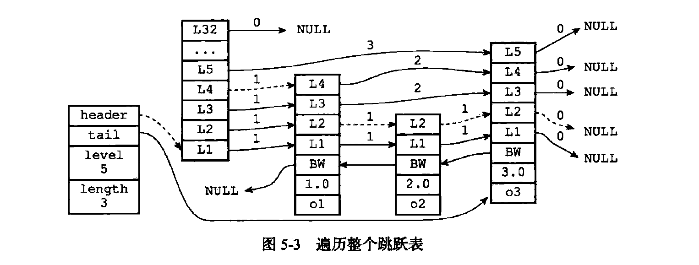

https://www.cnblogs.com/paulversion/p/8194966.html

Redis使用 **跳跃表 skiplist** 作为有序集合键的的底层实现,如果一个有序集合包含的元素数量比较多，又或者有序集合中元素的成员是比较长的字符串时Redis就会使用跳跃表来作为有序集合键的底层实现

Redis只在两个地方用到了跳跃表，一个是实现`有序集合键`，另一个是在`集群节点中用作内部数据结构`

### 跳跃表

跳跃表的数据结构为
```c
typedef struct zskiplist{
  //表头节点和表尾节点
  struct skiplistNode * header,* tail;
  //表中节点的数量
  unsigned long lenght;
  //表中层数最大的节点的层数
  int level;
} zskiplist;
```
`header`:指向跳跃表的表头节点
`tail`:指向跳跃表的表尾节点
`level`:记录目前跳跃表内层次最大的那个节点的层数（表头除外）
获取表头和表尾时间复杂度O(1)
`lenght`:记录跳跃表的长度跳跃表目前包含节点的数量（表头除外）
获取有序集合的时间复杂度为O(1)

将包含给定成员和分值的新节点添加到跳跃表中 平均O(logN) 最坏O(N)

删除跳跃表中包含给定成员和分值的节点  平均O(logN) 最坏O(N)

返回包含给定成员和分值的节点在跳跃表中的排位 平均O(logN) 最坏O(N)

返回跳跃表在给定排位上的节点  平均O(logN) 最坏O(N)

### 跳跃表节点

跳跃表节点的数据结构为
```c
/* ZSETs use a specialized version of Skiplists */
typedef struct zskiplistNode {
    sds ele;
    //成员对象
    robj * obj;
    //分值
    double score;
    //后退指针
    struct zskiplistNode * backward;
    struct zskiplistLevel {
      //前进指针
        struct zskiplistNode * forward;
        //跨度
        unsigned long span;
    } level[];
} zskiplistNode;
```
跳跃表节点的level数组可以包含`多个level`，每个level都带有两个属性：`前进指针和跨度`
`前进指针`用于访问位于表尾方向的其他节点，`跨度`记录了前进指针所指向节点和当前节点的距离。
两个节点之间的跨度越大，它们相距的就越远

指向NULL的所有前进指针的跨度都为0(没有连向任何节点) 跨度实际上是用来计算排位(rank)的在查找节点的过程中将沿途访问过的所有层的跨度累计起来得到的结果就是目标节点在跳跃表中的排位

当程序从表头向表尾进行遍历时访问会沿着层的前进指针进行。

`backward` 后退指针它指向位于当前节点的前一个节点后退指针在程序从表尾向表头遍历 节点的后退指针和一次跳过多个节点的前进指针不同，因为每个节点只有一个后退指针，所以每次只能后退至前一个节点。

`score` 分值 在节点中所保存的分值 在跳跃表中节点按各自所保存的分值从小到大排序

`obj` 各个节点中所保存的成员对象 obj 是一个指针它指向一个字符串对象，而字符串对象保存一个SDS 在同一个跳跃表中各个节点的成员对象必须是唯一的但是多个节点保存的分值可以是相同的分值相同的节点按照成员对象在字典

序中的大小来进行排序成员对象较小的节点会排在前面成员对象较大的节点则会排在后面

表头节点和其他节点的构造是一样的表头节点也有后退指针、分值和成员对象，不过表头节点的这些属性都不会被用到
下图为完整的跳跃表

<div align="center">  </div>

程序可以通过这些层来加快访问其他节点的速度，一般来说层的数量越多访问其他节点的速度就越快

每次创建一个新跳跃表节点的时候，程序都根据幂次定律随机生成一个介于1和32之间的值作为level数组的大小，这个大小就是层的高度

遍历下图的跳跃表
<div align="center">  </div>


程序首先访问跳跃表的第一个节点(header节点)，然后从第四层的前进指针移动到表中的第二个节点(第二个节点先指向L4  L4的forward指针指向L2)

在第二节点时，程序沿着第二层的前进指针移到表中的第三个节点

在第三个节点时程序同样沿着第二层的前进指针移动到表中的第四个节点

当程序再次沿着第四个节点的前进指针移动时，它碰到一个null，程序知道这时已经到达了跳跃表的表尾，于是结束这次遍历。
