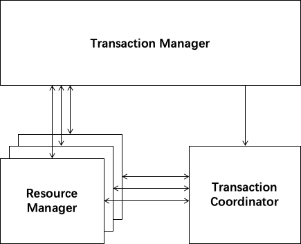
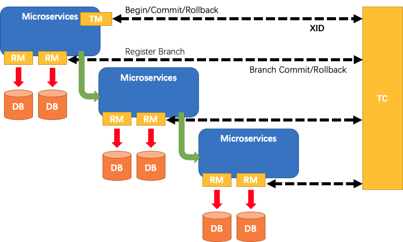

seata(fescar)

https://github.com/seata/seata

There are 3 basic components in Seata:

Transaction Coordinator(TC): Maintain status of global and branch transactions, drive the global commit or rollback.
Transaction Manager(TM): Define the scope of global transaction: begin a global transaction, commit or rollback a global transaction.
Resource Manager(RM): Manage resources that branch transactions working on, talk to TC for registering branch transactions and reporting status of branch transactions, and drive the branch transaction commit or rollback.

FESCAR有三个基础组件:

* `Transaction Coordinator(TC)`: 全局和分支事务的状态的保持，驱动这个全局的提交和回滚.
* `Transaction Manager(TM)`: 明确全局事务的范围：开始一个全局事务，提交或者回滚一个全局事务.
* `Resource Manager(RM)`: 管理分支事务工作资源，告诉TC，注册这个分支事务和上报分支事务的状态，驱动分支事务的的提交和回滚。

A typical lifecycle of Seata managed distributed transaction:

TM asks TC to begin a new global transaction. TC generates an XID representing the global transaction.
XID is propagated through microservices' invoke chain.
RM register local transaction as a branch of the corresponding global transaction of XID to TC.
TM asks TC for committing or rollbacking the corresponding global transaction of XID.
TC drives all branch transactions under the corresponding global transaction of XID to finish branch committing or rollbacking.

一个典型的FESCAR管理分布式事务的生命周期：

* TM询问TC开启一个新的全局事务，TC生成一个XID，代表这个全局事务
* XID 通过微服务的调用链传播
* RM将本地事务注册为XID到TC的相应全局事务的分支。
* TM要求TC提交或回滚XID的对应的全局事务。
* TC驱动整个分支在XID对应的全局事务下，去完成分支的提交或者回滚
* TM asks TC to begin a new global transaction. TC generates an XID representing the global transaction.
* XID is propagated through microservices' invoke chain.
* RM register local transaction as a branch of the corresponding global transaction of XID to TC.
* TM asks TC for committing or rollbacking the corresponding global transaction of XID.
* TC drives all branch transactions under the corresponding global transaction of XID to finish branch committing or rollbacking.

