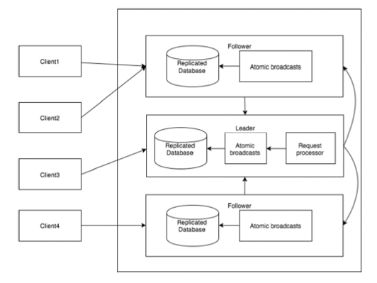

  一旦 **ZooKeeper集合** 启动，它将等待客户端连接。客户端将连接到ZooKeeper集合中的一个节点。它可以是leader或follower节点。
  一旦 **客户端被连接**，节点将向特定客户端分配会话ID并向该客户端发送确认。
  如果客户端没有收到确认，它将尝试连接ZooKeeper集合中的另一个节点。 一旦连接到节点，客户端将以有规律的间隔向节点发送心跳，以确保连接不会丢失。

  * **如果客户端想要读取特定的znode**，它将会向具有znode路径的节点发送读取请求，并且节点通过从其自己的数据库获取来返回所请求的znode。为此，在ZooKeeper集合中读取速度很快。
  * **如果客户端想要将数据存储在ZooKeeper集合中**，则会将znode路径和数据发送到服务器。连接的服务器将该请求转发给leader，然后leader将向所有的follower重新发出写入请求。如果只有大部分节点成功响应，而写入请求成功，则成功返回代码将被发送到客户端。 否则，写入请求失败。绝大多数节点被称为 **Quorum** 。

**ZooKeeper集合中的节点**
  让我们分析在ZooKeeper集合中拥有不同数量的节点的效果。

  如果我们有 **单个节点**，则当该节点故障时，ZooKeeper集合将故障。它有助于“单点故障"，不建议在生产环境中使用。

  如果我们有 **两个节点** 而一个节点故障，我们没有占多数，因为两个中的一个不是多数。

  如果我们有 **三个节点** 而一个节点故障，那么我们有大多数，因此，这是最低要求。ZooKeeper集合在实际生产环境中必须至少有三个节点。

  如果我们有 **四个节点** 而两个节点故障，它将再次故障。类似于有三个节点，额外节点不用于任何目的，因此，最好添加奇数的节点，例如3，5，7。

  我们知道写入过程比ZooKeeper集合中的读取过程要贵，因为所有节点都需要在数据库中写入相同的数据。因此，对于平衡的环境拥有较少数量（例如3，5，7）的节点比拥有大量的节点要好。

  下图描述了ZooKeeper工作流，后面的表说明了它的不同组件。
  

      组件	                                       描述
  **写入（write）**	                        写入过程由leader节点处理。leader将写入请求转发到所有znode，并等待znode的回复。如果一半的znode回复，则写入过程完成。
  **读取（read）**	                        读取由特定连接的znode在内部执行，因此不需要与集群进行交互。
  **复制数据库（replicated database）**	   它用于在zookeeper中存储数据。每个znode都有自己的数据库，每个znode在一致性的帮助下每次都有相同的数据。
  **Leader**                               Leader是负责处理写入请求的Znode。
  **Follower**	                           follower从客户端接收写入请求，并将它们转发到leader znode。
  **请求处理器（request processor）**     	 只存在于leader节点。它管理来自follower节点的写入请求。
  **原子广播（atomic broadcasts）**        	负责广播从leader节点到follower节点的变化。
