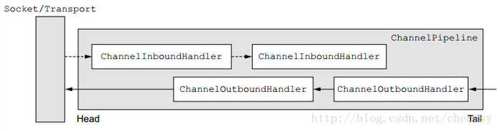

原文出处http://cmsblogs.com/ 『chenssy』

什么是 Netty？

    Netty 是一款提供异步的、事件驱动的网络应用程序框架和工具，用以快速开发高性能、高可靠性的网络服务器和客户端程序

    也就是说，Netty 是一个基于 NIO 的客户、服务器端编程框架，使用 Netty 可以确保你快速和简单地开发出一个网络应用，例如实现了某种协议的客户，服务端应用。Netty 相当简化和流线化了网络应用的编程开发过程，例如，TCP 和 UDP 的 socket 服务开发。（以上摘自百度百科）。

Netty具有如下特性（摘自《Netty in Action》）

`设计`
  * 统一的API，支持多种传输类型，阻塞和非阻塞的
  * 简单而强大的线程模型
  * 真正的无连接数据报套接字支持
  * 链接逻辑组件以支持复用

`易于使用`
  * 详实的 Javadoc 和大量的示例集
  * 不需要超过JdK 1.6+的依赖

`性能`
  * 拥有比 Java 的核心 API 更高的吞吐量以及更低的延迟
  * 得益于池化和复用，拥有更低的资源消耗
  * 最少的内存复制

`健壮性`
  * 不会因为慢速、快速或者超载的连接而导致 OutOfMemoryError
  * 消除在高速网络中 NIO 应用程序常见的不公平读/写比率

`安全性`
  * 完整的 SSL/TLS 以及 StartTLs 支持
  * 可用于受限环境下，如 Applet 和 OSGI

`社区驱动`
  * 发布快速而且频繁

### Netty核心组件

  为了后期更好地理解和进一步深入 Netty，有必要总体认识一下 Netty 所用到的核心组件以及他们在整个 Netty 架构中是如何协调工作的。Nettty 有如下几个核心组件：

  * Channel
  * ChannelFuture
  * EventLoop
  * ChannelHandler
  * ChannelPipeline

### Channel
  Channel 是 Netty 网络操作抽象类，它除了包括基本的 I/O 操作，如 `bind`、`connect`、`read`、`write` 之外，还包括了 Netty 框架相关的一些功能，如获取该 Channel 的 `EventLoop`。

  在传统的网络编程中，作为核心类的 Socket ，它对程序员来说并不是那么友好，直接使用其成本还是稍微高了点。而Netty 的 Channel 则提供的一系列的 API ，它大大降低了直接与 Socket 进行操作的复杂性。而相对于原生 NIO 的 Channel，Netty 的 Channel 具有如下优势（摘自《Netty权威指南（第二版）》）：

  * 在 Channel 接口层，采用 `Facade` 模式进行统一封装，将网络 I/O 操作、网络 I/O 相关联的其他操作封装起来，统一对外提供。
  * Channel 接口的定义尽量大而全，为 `SocketChannel` 和 `ServerSocketChannel` 提供统一的视图，由不同子类实现不同的功能，公共功能在抽象父类中实现，最大程度地实现功能和接口的重用。
  * 具体实现采用聚合而非包含的方式，将相关的功能类聚合在 Channel 中，有 Channel 统一负责和调度，功能实现更加灵活。

### EventLoop
  Netty 基于事件驱动模型，使用不同的事件来通知我们状态的改变或者操作状态的改变。它定义了在整个连接的生命周期里当有事件发生的时候处理的核心抽象。

  `Channel` 为Netty `网络操作抽象类`，`EventLoop` 主要是`为Channel 处理 I/O 操作`，两者配合参与 I/O 操作。

  下图是Channel、EventLoop、Thread、EventLoopGroup之间的关系（摘自《Netty In Action》）：

  

  * 一个 EventLoopGroup 包含一个或多个 EventLoop。
  * 一个 EventLoop 在它的生命周期内只能与一个Thread绑定。
  * 所有有 EnventLoop 处理的 I/O 事件都将在它专有的 Thread 上被处理。
  * 一个 Channel 在它的生命周期内只能注册与一个 EventLoop。
  * 一个 EventLoop 可被分配至一个或多个 Channel 。

  当一个连接到达时，Netty 就会注册一个 Channel，然后从 EventLoopGroup 中分配一个 EventLoop 绑定到这个Channel上，在该Channel的整个生命周期中都是有这个绑定的 EventLoop 来服务的。

### ChannelFuture

  Netty 为异步非阻塞，即所有的 I/O 操作都为异步的，因此，我们不能立刻得知消息是否已经被处理了。
  Netty 提供了 ChannelFuture 接口，通过该接口的 `addListener()` 方法注册一个 `ChannelFutureListener`，当操作执行成功或者失败时，监听就会自动触发返回结果。

### ChannelHandler
  `ChannelHandler` 为 Netty 中最核心的组件，它 **充当了所有处理入站和出站数据的应用程序逻辑的容器**。

  ChannelHandler 主要用来处理各种事件，这里的事件很广泛，比如可以是连接、数据接收、异常、数据转换等。

  ChannelHandler 有两个核心子类 ChannelInboundHandler 和 ChannelOutboundHandler，其中 ChannelInboundHandler 用于接收、处理入站数据和事件，而 ChannelOutboundHandler 则相反。

### ChannelPipeline
  `ChannelPipeline` **为 ChannelHandler 链提供了一个容器并定义了用于沿着链传播入站和出站事件流的 API**。一个数据或者事件可能会被多个 Handler 处理，在这个过程中，数据或者事件经流 ChannelPipeline，由 ChannelHandler 处理。

  在这个处理过程中，一个 ChannelHandler 接收数据后处理完成后交给下一个 ChannelHandler，或者什么都不做直接交给下一个 ChannelHandler。

  

  当一个数据流进入 ChannlePipeline 时，它会从 ChannelPipeline 头部开始传给第一个 ChannelInboundHandler ，当第一个处理完后再传给下一个，一直传递到管道的尾部。与之相对应的是，当数据被写出时，它会从管道的尾部开始，先经过管道尾部的 “最后” 一个ChannelOutboundHandler，当它处理完成后会传递给前一个 ChannelOutboundHandler 。

  当 ChannelHandler 被添加到 ChannelPipeline 时，它将会被分配一个 `ChannelHandlerContext`，它代表了 ChannelHandler 和 ChannelPipeline 之间的绑定。

  其中 ChannelHandler 添加到 ChannelPipeline 过程如下：

  1. 一个 ChannelInitializer 的实现被注册到了 ServerBootStrap中
  2. 当 ChannelInitializer.initChannel() 方法被调用时，ChannelInitializer 将在 ChannelPipeline 中安装一组自定义的 ChannelHandler
  3. ChannelInitializer 将它自己从 ChannelPipeline 中移除
