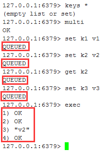
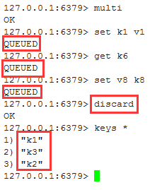
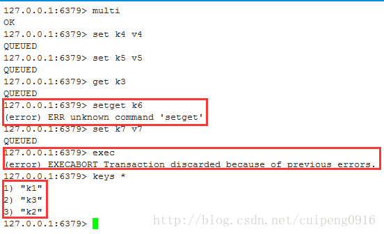
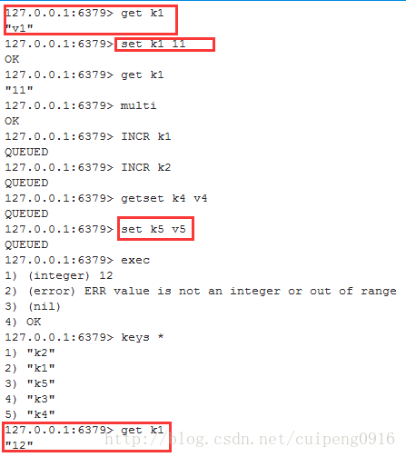
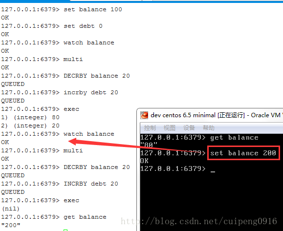

https://blog.csdn.net/cuipeng0916/article/details/53698774

如果要进入事务要通过`MULTI命令`，但是这个命令的结果是成功的，有没有正确的执行那就是另外一码事了，这个就和java中的强引用是差不多个意思，，这些需要执行的命令都会入队并不会立即执行，通过`exec`执行事务中的命令，`discard`会放弃本次事务的操作

事务命令

序号|命令及描述
---|----
1	 | `DISCARD` 取消事务，放弃执行事务块内的所有命令。
2	 | `EXEC` 执行所有事务块内的命令。
3	 | `MULTI` 标记一个事务块的开始。
4	 | `UNWATCH` 取消 WATCH 命令对所有 key 的监视。
5  | `WATCH` key [key ...] 监视一个(或多个) key ，如果在事务执行之前这个(或这些) key 被其他命令所改动，那么事务将被打断。

redis事务能干嘛：一个队列中，一次性、顺序性、排他性的执行一系列命令

### 事务实例1：正常执行

大家可以看到，通过`multi`开启事务之后之后的所有命令都`入队 (QUEUED)`了，并没有立即执行，而是在执行`exec`命令之后执行的

### 事务实例2：放弃事务

这里呢所有的命令也是没有立即执行，而是将这些命令入队，如果你觉得这个队列中有些命令时不要执行的，那么通过`discard`命令来放弃，通过结果可以看出，放弃之后那些命令并没有执行，如果用关系型数据库中的术语来说，就是都回滚了

### 事务实例3：redis事务的一致性

开启事务之后，我在这里故意敲错一个命令，而后面的命令任然还在`入队`，但是通过`exec`命令执行之后发现这些改变并没有写入到数据库中。这个就像关系型数据库中的事务的一致性，要么一起成功，要么一起失败

### 事务实例4：事务的非一致性

首先呢改变k1值为11，然后开启事务，然后就执行命令了，最后大家看看结果，发现正确的命令执行了，而那些执行失败的命令是没有执行的。那么有的人就会发现，你这个命令不是和实例3一样的吗？兄弟，麻烦看清楚，这里是不一样的，实例3中有

`setget k6`

但是这种命令在redis中是不存在的，这个就好比是java的运行时异常和非运行时异常一个意思。所以实例3中事务都回滚了，但是实例4中的部分成功，部分失败。

那么对于实例3和实例4我们可以的出的总结是：
redis对事务是部分支持的，如果是在`入队时报错`，那么`都不会执行`；在`非入队时报错`，那么`成功的就会成功执行`。

### redis监控：锁的介绍

在MySQL中我们都知道有行锁和表锁的概念，所谓的行锁也就是把我需要改的那一行给锁住，不让其他的事务去修改；而表锁就是在修改一张表的时候把整张表都锁住，不让其他的事务修改，所以行锁的效率比表锁的概念更高，那么在redis也存在锁的概念

 * 乐观锁（Optimistic Lock）： 顾名思义，就是很乐观，每次去拿数据的时候都认为别人不会修改，所以不会上锁，但是在更新的时候会判断一下在此期间别人有没有去更新这个数据，可以使用版本号等机制。乐观锁适用于多读的应用类型，这样可以提高吞吐量，乐观锁策略:提交版本必须大于记录当前版本才能执行更新
 * 悲观锁（Pessimistic Lock）： 顾名思义，就是很悲观，每次去拿数据的时候都认为别人会修改，所以每次在拿数据的时候都会上锁，这样别人想拿这个数据就会block直到它拿到锁。传统的关系型数据库里边就用到了很多这种锁机制，比如行锁，表锁等，读锁，写锁等，都是在做操作之前先上锁
 * CAS（Check And Set）：

### 监控实例：银行卡余额

大家可以看到，我在watch银行卡余额时然后将余额修改成200，在开启事务去修改余额，发现事务执行失败，因为这个时候在事务执行之前余额已经被其他人修改过了，所以事务执行失败了。
类似乐观锁，事务提交时，如果Key的值已被别的客户端改变，比如某个list已被别的客户端push/pop过了，整个事务队列都不会被执行。
通过WATCH命令在事务执行之前监控了多个Keys，倘若在`WATCH之后`有任何`Key`的值`发生了变化`，`EXEC命令`执行的事务都将被`放弃`，同时返回`Nullmulti-bulk`应答以通知调用者事务执行失败

在watch余额之后发现有人修改过余额，那么我们就可以取消watch，也就是unwatch，然后确认没有人去修改余额再去watch余额，开启事务，对余额操作，我们发现余额修改成功

上面呢我们通过实例说明了redis的事务

### redis事务三阶段：

1. 开启：以MULTI开始一个事务
2. 入队：将多个命令入队到事务中，接到这些命令并不会立即执行，而是放到等待执行的事务队列里面
3. 执行：由EXEC命令触发事务

### redis事务三大特性：

1. 单独的隔离操作：事务中的所有命令都会序列化、按顺序地执行。事务在执行的过程中，不会被其他客户端发送来的命令请求所打断。
2. 没有隔离级别的概念：队列中的命令没有提交之前都不会实际的被执行，因为事务提交前任何指令都不会被实际执行，也就不存在”事务内的查询要看到事务里的更新，在事务外查询不能看到”这个让人万分头痛的问题
3. 不保证原子性：redis同一个事务中如果有一条命令执行失败，其后的命令仍然会被执行，没有回滚
