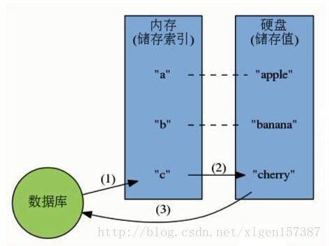
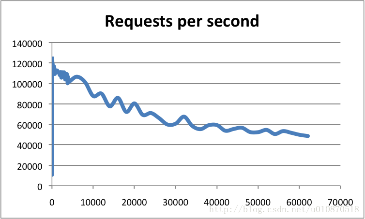
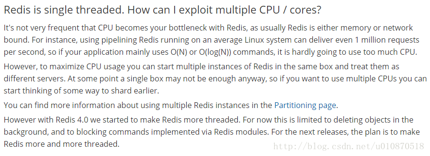

https://blog.csdn.net/chenyao1994/article/details/79491337
### 一、前言
近乎所有与Java相关的面试都会问到缓存的问题，基础一点的会问到什么是“二八定律”、什么是“热数据和冷数据”，复杂一点的会问到缓存雪崩、缓存穿透、缓存预热、缓存更新、缓存降级等问题，这些看似不常见的概念，都与我们的缓存服务器相关，一般常用的缓存服务器有Redis、Memcached等，而笔者目前最常用的也只有Redis这一种。

如果你在以前面试的时候还没有遇到过面试官问你《为什么说Redis是单线程的以及Redis为什么这么快！》，那么你看到这篇文章的时候，你应该觉得是一件很幸运的事情！如果你刚好是一位高逼格的面试官，你也可以拿这道题去面试对面“望穿秋水”般的小伙伴，测试一下他的掌握程度。

好啦！步入正题！我们先探讨一下Redis是什么，Redis为什么这么快、然后在探讨一下为什么Redis是单线程的？

### 二、Redis简介
Redis是一个开源的内存中的数据结构存储系统，它可以用作：`数据库、缓存和消息中间件`。

它支持多种类型的数据结构，如字符串（Strings），散列（Hash），列表（List），集合（Set），有序集合（Sorted Set或者是ZSet）与范围查询，Bitmaps，Hyperloglogs 和地理空间（Geospatial）索引半径查询。其中常见的数据结构类型有：`String、List、Set、Hash、ZSet`这5种。

Redis 内置了`复制（Replication）`，`LUA脚本（Lua scripting）`， `LRU驱动事件（LRU eviction）`，`事务（Transactions）` 和不同级别的磁盘持久化`（Persistence）`，并通过 `Redis哨兵（Sentinel）`和`自动分区（Cluster）`提供`高可用性（High Availability）`。

Redis也提供了持久化的选项，这些选项可以让用户将自己的数据保存到磁盘上面进行存储。根据实际情况，可以`每隔一定时间将数据集导出到磁盘（快照）`，或者`追加到命令日志中（AOF只追加文件）`，他会在执行写命令时，将被执行的写命令复制到硬盘里面。您也可以关闭持久化功能，将Redis作为一个高效的网络的缓存数据功能使用。

Redis不使用表，他的数据库不会预定义或者强制去要求用户对Redis存储的不同数据进行关联。

数据库的工作模式按存储方式可分为：硬盘数据库和内存数据库。Redis 将数据储存在内存里面，读写数据的时候都不会受到硬盘 I/O 速度的限制，所以速度极快。

（1）硬盘数据库的工作模式：
<div align="center">  </div>

（2）内存数据库的工作模式：
<div align="center">  </div>

看完上述的描述，对于一些常见的Redis相关的面试题，是否有所认识了，例如：什么是Redis、Redis常见的数据结构类型有哪些、Redis是如何进行持久化的等。

### 三、Redis到底有多快
Redis采用的是基于内存的采用的是单进程单线程模型的 KV 数据库，由C语言编写，官方提供的数据是可以达到100000+的QPS（每秒内查询次数）。这个数据不比采用单进程多线程的同样基于内存的 KV 数据库 Memcached 差！有兴趣的可以参考官方的基准程序测试《How fast is Redis？》（https://redis.io/topics/benchmarks）

<div align="center">  </div>

横轴是连接数，纵轴是QPS。此时，这张图反映了一个数量级，希望大家在面试的时候可以正确的描述出来，不要问你的时候，你回答的数量级相差甚远！

### 四、Redis为什么这么快
1、完全基于内存，绝大部分请求是纯粹的内存操作，非常快速。数据存在内存中，类似于HashMap，HashMap的优势就是查找和操作的时间复杂度都是O(1)；

2、数据结构简单，对数据操作也简单，Redis中的数据结构是专门进行设计的；

3、采用单线程，避免了不必要的上下文切换和竞争条件，也不存在多进程或者多线程导致的切换而消耗 CPU，不用去考虑各种锁的问题，不存在加锁释放锁操作，没有因为可能出现死锁而导致的性能消耗；

4、使用多路I/O复用模型，非阻塞IO；

5、使用底层模型不同，它们之间底层实现方式以及与客户端之间通信的应用协议不一样，Redis直接自己构建了VM 机制 ，因为一般的系统调用系统函数的话，会浪费一定的时间去移动和请求；

以上几点都比较好理解，下边我们针对多路 I/O 复用模型进行简单的探讨：

（1）多路 I/O 复用模型

多路I/O复用模型是利用 select、poll、epoll 可以同时监察多个流的 I/O 事件的能力，在空闲的时候，会把当前线程阻塞掉，当有一个或多个流有 I/O 事件时，就从阻塞态中唤醒，于是程序就会轮询一遍所有的流（epoll 是只轮询那些真正发出了事件的流），并且只依次顺序的处理就绪的流，这种做法就避免了大量的无用操作。

这里“多路”指的是多个网络连接，“复用”指的是复用同一个线程。采用多路 I/O 复用技术可以让单个线程高效的处理多个连接请求（尽量减少网络 IO 的时间消耗），且 Redis 在内存中操作数据的速度非常快，也就是说内存内的操作不会成为影响Redis性能的瓶颈，主要由以上几点造就了 Redis 具有很高的吞吐量。

### 五、那么为什么Redis是单线程的
我们首先要明白，上边的种种分析，都是为了营造一个Redis很快的氛围！官方FAQ表示，因为Redis是基于内存的操作，CPU不是Redis的瓶颈，Redis的瓶颈最有可能是机器内存的大小或者网络带宽。既然单线程容易实现，而且CPU不会成为瓶颈，那就顺理成章地采用单线程的方案了（毕竟采用多线程会有很多麻烦！）。

<div align="center">  </div>
可以参考：https://redis.io/topics/faq

看到这里，你可能会气哭！本以为会有什么重大的技术要点才使得Redis使用单线程就可以这么快，没想到就是一句官方看似糊弄我们的回答！但是，我们已经可以很清楚的解释了为什么Redis这么快，并且正是由于在单线程模式的情况下已经很快了，就没有必要在使用多线程了！

但是，我们使用单线程的方式是无法发挥多核CPU 性能，不过我们可以通过在单机开多个Redis 实例来完善！

警告1：这里我们一直在强调的单线程，只是在处理我们的网络请求的时候只有一个线程来处理，一个正式的Redis Server运行的时候肯定是不止一个线程的，这里需要大家明确的注意一下！例如Redis进行持久化的时候会以子进程或者子线程的方式执行（具体是子线程还是子进程待读者深入研究）；例如我在测试服务器上查看Redis进程，然后找到该进程下的线程：

<div align="center">  </div>

ps命令的“-T”参数表示显示线程（Show threads, possibly with SPID column.）“SID”栏表示线程ID，而“CMD”栏则显示了线程名称。

警告2：在上图中FAQ中的最后一段，表述了从Redis 4.0版本开始会支持多线程的方式，但是，只是在某一些操作上进行多线程的操作！所以该篇文章在以后的版本中是否还是单线程的方式需要读者考证！

### 六、注意点
1、我们知道Redis是用”单线程-多路复用IO模型”来实现高性能的内存数据服务的，这种机制避免了使用锁，但是同时这种机制在进行sunion之类的比较耗时的命令时会使redis的并发下降。因为是单一线程，所以同一时刻只有一个操作在进行，所以，耗时的命令会导致并发的下降，不只是读并发，写并发也会下降。而单一线程也只能用到一个CPU核心，所以可以在同一个多核的服务器中，可以启动多个实例，组成master-master或者master-slave的形式，耗时的读命令可以完全在slave进行。

需要改的redis.conf项：
```
pidfile /var/run/redis/redis_6377.pid  #pidfile要加上端口号
port 6377  #这个是必须改的
logfile /var/log/redis/redis_6377.log #logfile的名称也加上端口号
dbfilename dump_6377.rdb  #rdbfile也加上端口号
```
2、“我们不能任由操作系统负载均衡，因为我们自己更了解自己的程序，所以，我们可以手动地为其分配CPU核，而不会过多地占用CPU，或是让我们关键进程和一堆别的进程挤在一起。”。
CPU 是一个重要的影响因素，由于是单线程模型，Redis 更喜欢大缓存快速 CPU， 而不是多核

在多核 CPU 服务器上面，Redis 的性能还依赖NUMA 配置和处理器绑定位置。最明显的影响是 redis-benchmark 会随机使用CPU内核。为了获得精准的结果，需要使用固定处理器工具（在 Linux 上可以使用 taskset）。最有效的办法是将客户端和服务端分离到两个不同的 CPU 来高校使用三级缓存。

七、扩展
以下也是你应该知道的几种模型，祝你的面试一臂之力！

* 1、单进程多线程模型：MySQL、Memcached、Oracle（Windows版本）；

* 2、多进程模型：Oracle（Linux版本）；

* 3、Nginx有两类进程，一类称为Master进程(相当于管理进程)，另一类称为Worker进程（实际工作进程）。启动方式有两种：

（1）单进程启动：此时系统中仅有一个进程，该进程既充当Master进程的角色，也充当Worker进程的角色。

（2）多进程启动：此时系统有且仅有一个Master进程，至少有一个Worker进程工作。

（3）Master进程主要进行一些全局性的初始化工作和管理Worker的工作；事件处理是在Worker中进行的。

<div align="center">  </div>

参考文章：

1、http://www.syyong.com/db/Redis-why-the-use-of-single-process-and-single-threaded-way-so-fast.html
2、http://blog.csdn.net/xxb2008/article/details/42238557
3、http://blog.csdn.net/hobbs136/article/details/7619719
4、http://blog.csdn.net/yushitao/article/details/43565851
