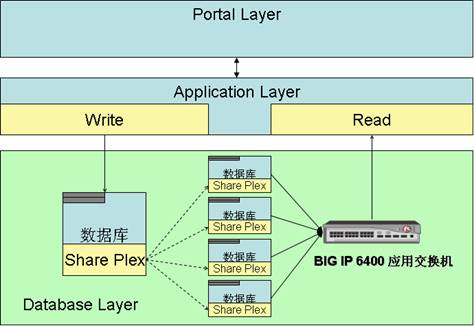
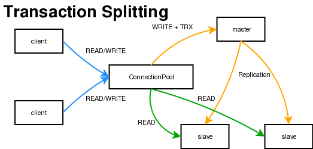

https://blog.csdn.net/itomge/article/details/6909240

随着一个网站的业务不断扩展，数据不断增加，数据库的压力也会越来越大，对数据库或者SQL的基本优化可能达不到最终的效果，我们可以采用读写分离的策略来改变现状。

读写分离简单的说是把对`数据库读和写的操作分开对应不同的数据库服务器`，这样能有效地减轻数据库压力，也能减轻io压力。

主数据库提供写操作，从数据库提供读操作，其实在很多系统中，主要是读的操作。当主数据库进行写操作时，数据要同步到从的数据库，这样才能有效保证数据库完整性。

Quest SharePlex就是比较牛的同步数据工具，听说比oracle本身的流复制还好，mysql也有自己的同步数据技术。mysql只要是通过二进制日志来复制数据。通过日志在从数据库重复主数据库的操作达到复制数据目的。这个复制比较好的就是通过异步方法，把数据同步到从数据库。

采用读写分离有如下工具：
  1. oracle的logical standby
  2. Quest公司的SharePlex
  3. DSG公司的RealSync

主数据库同步到从数据库后，从数据库一般由多台数据库组成这样才能达到减轻压力的目的。

读的操作怎么样分配到从数据库上？应该根据服务器的压力把读的操作分配到服务器，而不是简单的随机分配。mysql提供了MySQL-Proxy实现读写分离操作。不过MySQL-Proxy好像很久不更新了。oracle可以通过F5有效分配读从数据库的压力。

<div align="center">  </div>

ebay的读写分离
<div align="center">  </div>


`MySQL Replication`可以将master的数据复制分布到多个slave上，然后可以利用slave来分担master的读压力。

那么对于前台应用来说，就要考虑如何将读的压力分布到多个slave上。如果每个应用都需要来实现读写分离的算法，一则成本太高，二来如果slave增加更多的机器，应用就要随之修改。明显的，如果在应用和数据库间加一个专门用于实现读写分离的中间层，则整个系统的架构拥有更好的扩展性。

`MySQL Proxy`就是这么一个中间层代理，基本的原理是让主数据库处理事务性查询，而从数据库处理SELECT查询。数据库复制被用来把事务性查询导致的变更同步到集群中的从数据库。
简单的说，MySQL Proxy就是一个连接池，负责将前台应用的连接请求转发给后台的数据库，并且通过使用lua脚本，可以实现复杂的连接控制和过滤，从而实现读写分离和负载平衡。对于应用来说，MySQL Proxy是完全透明的，应用则只需要连接到MySQL Proxy的监听端口即可。当然，这样proxy机器很可能造成单点失效，可以使用多个proxy机器做为冗余来解决这个问题，在应用服务器的连接池配置中配置到多个proxy的连接参数即可。

MySQL Proxy的安装地址：http://blog.51yip.com/mysql/399.html

实现读写分离的LUA脚本：
```
　　--
　　-- 发送所有的非事务性Select到一个从数据库
　　if is_in_transaction == 0 and
　　packet:byte() == proxy.COM_QUERY and
　　packet:sub(2, 7) == "SELECT" then
　　local max_conns = -1
　　local max_conns_ndx = 0
　　for i = 1, #proxy.servers do
　　local s = proxy.servers[i]
　　-- 需要选择一个拥有空闲连接的从数据库
　　if s.type == proxy.BACKEND_TYPE_RO and
　　s.idling_connections > 0 then
　　if max_conns == -1 or
　　s.connected_clients < max_conns then
　　max_conns = s.connected_clients
　　max_conns_ndx = i
　　end
　　end
　　end
　　-- 至此，我们找到了一个拥有空闲连接的从数据库
　　if max_conns_ndx > 0 then
　　proxy.connection.backend_ndx = max_conns_ndx
　　end
　　else
　　-- 发送到主数据库
　　end
　　return proxy.PROXY_SEND_QUERY
```
