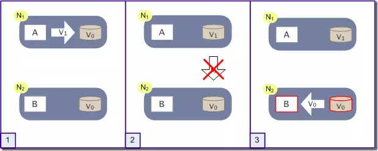

https://juejin.im/post/5b26634b6fb9a00e765e75d1

### 前言
CAP原则又称CAP定理，指的是在一个分布式系统中，`Consistency（一致性）`、 `Availability（可用性）`、`Partition tolerance（分区容错性）`这三个基本需求，最多只能同时满足其中的2个。

### 1. CAP原则简介

**Consistency（一致性）**
指数据在多个副本之间能够保持一致的特性（严格的一致性）

**Availability（可用性）**
指系统提供的服务必须一直处于可用的状态，每次请求都能获取到非错的响应（不保证获取的数据为最新数据）

**Partition tolerance（分区容错性）**
分布式系统在遇到任何网络分区故障的时候，仍然能够对外提供满足一致性和可用性的服务，除非整个网络环境都发生了故障

**什么是分区？**

在分布式系统中，不同的节点分布在不同的子网络中，由于一些特殊的原因，这些子节点之间出现了网络不通的状态，但他们的内部子网络是正常的。从而导致了整个系统的环境被切分成了若干个孤立的区域，这就是分区。

### 2. CAP原则论证

如图所示，是我们证明CAP的基本场景，网络中有两个节点N1和N2，可以简单的理解N1和N2分别是两台计算机，他们之间网络可以连通，N1中有一个应用程序A，和一个数据库V，N2也有一个应用程序B和一个数据库V。现在，A和B是分布式系统的两个部分，V是分布式系统的数据存储的两个子数据库。

  

* 在满足一致性的时候，N1和N2中的数据是一样的，V0=V0。
* 在满足可用性的时候，用户不管是请求N1或者N2，都会得到立即响应。
* 在满足分区容错性的情况下，N1和N2有任何一方宕机，或者网络不通的时候，都不会影响N1和N2彼此之间的正常运作。

如图所示，这是分布式系统正常运转的流程，用户向N1机器请求数据更新，程序A更新数据库V0为V1。分布式系统将数据进行同步操作M，将V1同步的N2中V0，使得N2中的数据V0也更新为V1，N2中的数据再响应N2的请求。

  

根据CAP原则定义，系统的一致性、可用性和分区容错性细分如下：

* 一致性：N1和N2的数据库V之间的数据是否完全一样。
* 可用性：N1和N2的对外部的请求能否做出正常的响应。
* 分区容错性：N1和N2之间的网络是否互通。

这是正常运作的场景，也是理想的场景。作为一个分布式系统，它和单机系统的最大区别，就在于网络。现在假设一种极端情况，N1和N2之间的网络断开了，我们要支持这种网络异常。相当于要满足分区容错性，能不能同时满足一致性和可用性呢？还是说要对他们进行取舍？

  

假设在N1和N2之间网络断开的时候，有用户向N1发送数据更新请求，那N1中的数据V0将被更新为V1。由于网络是断开的，所以分布式系统同步操作M，所以N2中的数据依旧是V0。这个时候，有用户向N2发送数据读取请求，由于数据还没有进行同步，应用程序没办法立即给用户返回最新的数据V1，怎么办呢？
这里有两种选择：

* 第一：牺牲数据一致性，保证可用性。响应旧的数据V0给用户。
* 第二：牺牲可用性，保证数据一致性。阻塞等待，直到网络连接恢复，数据更新操作M完成之后，再给用户响应最新的数据V1。

这个过程，证明了要满足分区容错性的分布式系统，只能在一致性和可用性两者中，选择其中一个。

### 3. CAP原则权衡

通过CAP理论，我们知道无法同时满足一致性、可用性和分区容错性这三个特性，那要舍弃哪个呢？

#### 3.1. CA without P

如果不要求P（不允许分区），则C（强一致性）和A（可用性）是可以保证的。但其实分区不是你想不想的问题，而是始终会存在，因此CA的系统更多的是允许分区后各子系统依然保持CA。

#### 3.2. CP without A

如果不要求A（可用），相当于每个请求都需要在Server之间强一致，而P（分区）会导致同步时间无限延长，如此CP也是可以保证的。**很多传统的数据库分布式事务都属于这种模式。**

#### 3.3. AP wihtout C

要高可用并允许分区，则需放弃一致性。一旦分区发生，节点之间可能会失去联系，为了高可用，每个节点只能用本地数据提供服务，而这样会导致全局数据的不一致性。**现在众多的NoSQL都属于此类。**

### 小结

对于多数大型互联网应用的场景，主机众多、部署分散。而且现在的集群规模越来越大，所以节点故障、网络故障是常态。这种应用一般要保证服务可用性(Availability)达到N个9，即保证P和A，**只有舍弃C（退而求其次保证最终一致性）。** 虽然某些地方会影响客户体验，但没达到造成用户流程的严重程度。

对于涉及到钱财这样不能有一丝让步的场景，C必须保证。网络发生故障宁可停止服务，这是保证CA，舍弃P。貌似这几年国内银行业发生了不下10起事故，但影响面不大，报道也不多，广大群众知道的少。

还有一种是保证CP，舍弃A，例如网络故障时只读不写。

孰优孰劣，没有定论，只能根据场景定夺，适合的才是最好的。
