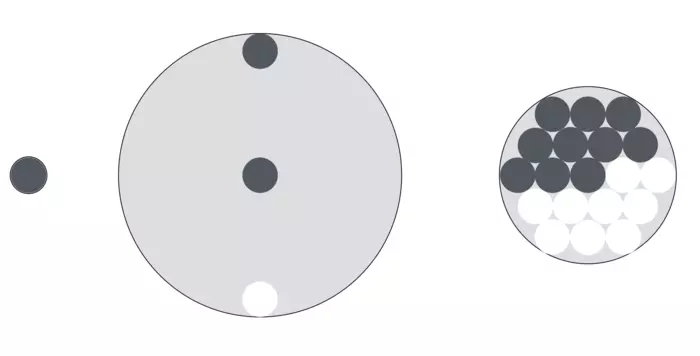
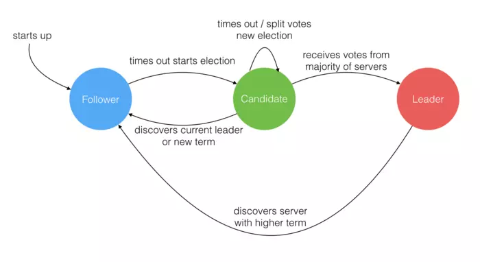
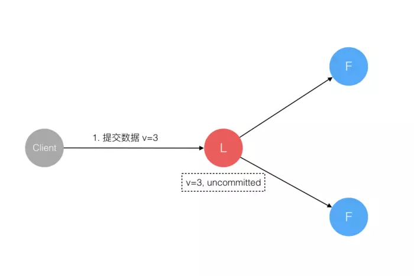
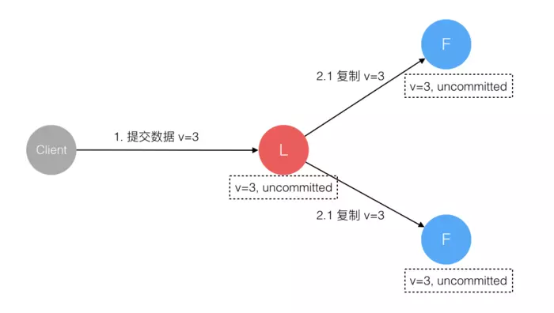
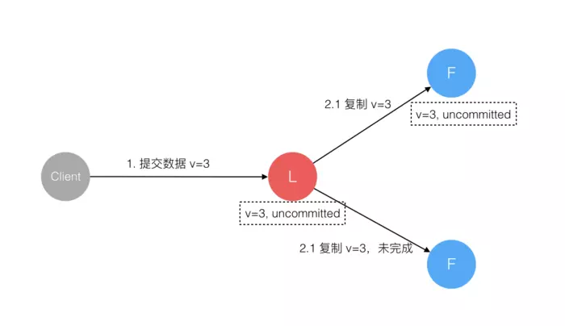
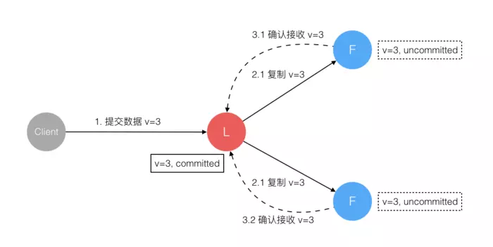
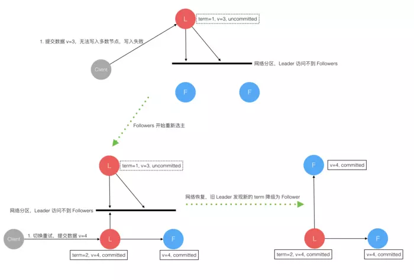

https://juejin.im/post/5b2664bd51882574874d8a76

### 前言
Raft 也是一个 一致性算法，和 Paxos 目标相同。但它还有另一个名字 - 易于理解的一致性算法。Paxos 和 Raft 都是为了实现 一致性 产生的。这个过程如同选举一样，参选者 需要说服 大多数选民 (服务器) 投票给他，一旦选定后就跟随其操作。Paxos 和 Raft 的区别在于选举的 具体过程 不同。

### 小试牛刀
在进入正题前，给大家分享一个《数学发散思维》中的一个故事，站在不同思维角度上，了解对一个问题理解的差异性。

问题: 甲乙两人轮流在一张圆桌上平放黑白围棋子，每次放一子，棋子不许重叠，谁先没有地方放就输。请问怎样放才能赢？

这个问题有两层意思，第一，有没有一种放法保证必赢？第二，如果有怎么证明？

  

上图回答了这个问题，那就是先行者必胜，这里使用了三种不同的思维方式来阐述:

1. 假如桌子只有一个围棋子那么大。

2. 假如桌子无限大，先行者先占住圆心。由于圆是对称图形，所以只要对手还能找到位置放，你总能在对称的另一面找到位置放。

3. 一个圆中可画单数个直径相等且互切的小圆。

三种不同的思维方式在可理解性难度上逐渐加深。

1. 第一种是 极简化思维，但数学上是 不严谨 的。

2. 第二种是 极限思维，和第一种结合起来就是 数学归纳法，在数学上是 严谨 的。

3. 第三种是 形象思维，使用了 几何学概念，但对于没有几何学基础知识的人就很难理解了。

### 什么是Raft协议

Raft 协议将 Server 进程分成三类，分别是 Leader，Candidate，Follower。一个 Server 进程在某一时刻，只能是其中 一种类型，但这不是固定的。不同的时刻，它可能拥有不同的类型，一个 Server 进程的类型是如何改变的，后面会有解释。
在一个由 Raft 协议组织的集群中有三类角色：

* Leader（领袖）
* Follower（群众）
* Candidate（候选人）

就像一个民主社会，领袖由民众投票选出。刚开始没有 领袖，所有集群中的 参与者 都是 群众，那么首先开启一轮大选。在大选期间 所有群众 都能参与竞选，这时所有群众的角色就变成了 候选人，民主投票选出领袖后就开始了这届领袖的任期，然后选举结束，所有除 领袖 的 候选人 又变回 群众角色 服从领袖领导。

这里提到一个概念 「任期」，用术语 Term 表达。关于 Raft 协议的核心概念和术语就这么多，而且和现实民主制度非常匹配，所以很容易理解。

三类角色的变迁图如下，结合后面的选举过程来看很容易理解。

  

### Leader选举过程

在极简的思维下，一个最小的 Raft 民主集群需要 三个参与者（如下图：A、B、C），这样才可能投出多数票。

初始状态 ABC 都是 Follower，然后发起选举这时有 三种 可能的情形发生。下图中前二种都能选出 Leader，第三种则表明 本轮投票无效（Split Votes）。对于第三种，每方都投给了自己，结果没有任何一方获得多数票。之后 每个参与方 随机休息一阵（Election Timeout）重新发起投票直到一方获得多数票。这里的关键就是随机 timeout，最先从 timeout 中恢复发起投票的一方，向还在 timeout 中的另外两方 请求投票，这时它就只能投给自己，导致很快达成一致。

  

选出 Leader 后，Leader 通过 定期 向所有 Follower 发送 心跳信息 维持其统治。若 Follower 一段时间未收到 Leader 的 心跳，则认为 Leader 可能已经挂了，然后再次发起 选举 过程。

### Leader对一致性的影响
Raft 协议 强依赖 Leader 节点的 可用性，以确保集群 数据的一致性。数据的流向 只能从 Leader 节点向 Follower 节点转移。具体过程如下：

  

1. 当 Client 向集群 Leader 节点 提交数据 后，Leader 节点 接收到的数据 处于 未提交状态（Uncommitted）。

2. 接着 Leader 节点会 并发地 向所有 Follower 节点 复制数据 并 等待接收响应。

3. 集群中至少 超过半数 的节点 已接收 到数据后， Leader 再向 Client 确认数据 已接收。

4. 一旦向 Client 发出数据接收 Ack 响应后，表明此时 数据状态 进入 已提交（Committed），Leader 节点再向 Follower 节点发通知告知该 数据状态已提交。

在这个过程中，主节点 可能在 任意阶段 挂掉，看下 Raft 协议如何针对不同阶段保障 数据一致性 的。

#### 1. 情形1

数据到达 Leader 节点前，这个阶段 Leader 挂掉不影响一致性，不用多说。

  

#### 2. 情形2

数据到达 Leader 节点，但未复制到 Follower 节点。

这个阶段 Leader 挂掉，数据属于 未提交状态，Client 不会收到 Ack 会认为 超时失败 可安全发起 重试。

  

Follower 节点上没有该数据，重新选主 后 Client 重试 重新提交 可成功。原来的 Leader 节点 恢复 后作为 Follower 加入集群，重新从 当前任期 的新 Leader 处 同步数据，强制保持和 Leader 数据一致。

#### 3. 情形3

数据到达 Leader 节点，成功复制到 Follower 所有节点，但 Follower 还未向 Leader 响应接收。

这个阶段 Leader 挂掉，虽然数据在 Follower 节点处于 未提交状态（Uncommitted），但是 保持一致 的。重新选出 Leader 后可完成 数据提交。

  

此时 Client 由于不知到底提交成功没有，可重试提交。针对这种情况 Raft 要求 RPC 请求实现 **幂等性**，也就是要实现 内部去重机制。

#### 4. 情形4

数据到达 Leader 节点，成功复制到 Follower 的部分节点，但这部分 Follower 节点还未向 Leader 响应接收。

这个阶段 Leader 挂掉，数据在 Follower 节点处于 未提交状态（Uncommitted）且 不一致。

  

Raft 协议要求投票只能投给拥有 最新数据 的节点。所以拥有最新数据的节点会被选为 Leader，然后再 强制同步数据 到其他 Follower，保证 数据不会丢失并 最终一致。

#### 5. 情形5

数据到达 Leader 节点，成功复制到 Follower 所有或多数节点，数据在 Leader 处于已提交状态，但在 Follower 处于未提交状态。

这个阶段 Leader 挂掉，重新选出 新的 Leader 后的处理流程和阶段 3 一样。

  

#### 6. 情形6

数据到达 Leader 节点，成功复制到 Follower 所有或多数节点，数据在所有节点都处于已提交状态，但还未响应 Client。

这个阶段 Leader 挂掉，集群内部数据其实已经是 一致的，Client 重复重试基于幂等策略对 一致性无影响。

  

#### 7. 情形7

网络分区导致的脑裂情况，出现双 Leader 的现象。

网络分区 将原先的 Leader 节点和 Follower 节点分隔开，Follower 收不到 Leader 的 心跳 将 重新 发起选举产生新的 Leader，这时就产生了 双Leader 现象。

  

原先的 Leader 独自在一个区，向它提交数据不可能复制到多数节点所以永远提交不成功。向新的 Leader 提交数据可以提交成功。
网络恢复 后，旧的 Leader 发现集群中有 更新任期（Term）的新 Leader ，则 自动降级 为 Follower 并从新 Leader 处 同步数据 达成集群 数据一致。

#### 验证结果

综上穷举分析了 最小集群（3 节点）面临的所有情况，可以看出 Raft 协议都能很好的应对 一致性问题，并且很容易理解。

### 小结
Paxos 算法是 Leslie Lamport 在 1990 年就公开发表在了自己的网站上，想想我们是什么时候才听说的？什么时候才有一个可用的实现？而 Raft 算法是 2013 年发表的，大家在参考 Raft开源实现库，可以看到有很多基于不同语言的 开源实现库，这就是 可理解性 的重要性。

Raft一致性算法论文的中文翻译
https://github.com/maemual/raft-zh_cn/blob/master/raft-zh_cn.md
